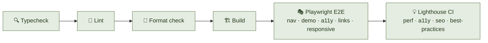

<!-- ░░░░░░░░░░░░░░░░░░░░░░░░░░░  ShilaTeq  ░░░░░░░░░░░░░░░░░░░░░░░░░░░ -->

<div align="center">


<br/>

<h1>🪨 ShilaTeq — Marketing &amp; Documentation Website</h1>

<p><em>The operating system for stone yards.</em><br/>
Your whole yard on one phone — every block, every rupee, every worker, every customer.</p>

<!-- ── Status badges ─────────────────────────────────────────── -->
<a href="https://github.com/GalacticVraj/ShilaTeq/actions/workflows/ci.yml">
  
</a>


<br/><br/>

<!-- ── Tech stack ────────────────────────────────────────────── -->


<br/>


<br/><br/>

<a href="#-quick-start"><strong>🚀 Quick start</strong></a> ·
<a href="#-project-structure"><strong>📁 Structure</strong></a> ·
<a href="#-site-map"><strong>🗺️ Site map</strong></a> ·
<a href="#-quality-gates"><strong>🧪 Quality</strong></a> ·
<a href="#-environment-variables"><strong>🔐 Config</strong></a>

</div>

---

## ✨ What is this?

This repository is the **public marketing &amp; documentation website** for **ShilaTeq** — a mobile-first, multi-tenant ERP built for the way Indian stone yards actually work: on cheap Android phones, in Hindi and English, across patchy shop-floor connectivity, in rupees and GST.

> [!NOTE]
> **This is the website, not the product.** The ShilaTeq platform (the ERP itself) lives in a separate codebase. This repo is the marketing front door: the story, the product pages, the demo funnel, comparisons, pricing, guides, and a full MDX documentation hub — all engineered to enterprise quality gates.

The site's job is to explain, in plain language, how one platform carries a stone block all the way from the quarry truck to a delivered, GST-compliant invoice — and to turn a visitor into a WhatsApp conversation or a demo.

<div align="center">

| 📇 Give every block an identity | 📶 Keep the shop floor working | 🇮🇳 Handle India-native commerce |
| :---: | :---: | :---: |
| QR-coded blocks &amp; slabs | Offline-first, bilingual EN / हिंदी | GST splits, HSN, ₹ in words |

</div>

---

## 🧱 Tech stack

| Layer | Choice | Why |
| --- | --- | --- |
| **Framework** | [Next.js 16](https://nextjs.org) (App Router, RSC) | Static-first marketing pages with server components; per-route metadata, sitemap, robots &amp; manifest |
| **UI** | [React 19](https://react.dev) + [Tailwind CSS v4](https://tailwindcss.com) | Design-token driven; light-theme locked, motion is progressive enhancement |
| **Language** | [TypeScript 5](https://www.typescriptlang.org) (strict) | `tsc --noEmit` is a CI gate |
| **Content** | [`next-mdx-remote`](https://github.com/hashicorp/next-mdx-remote) + `remark-gfm` + `rehype-slug` | The 14-part documentation hub renders from Markdown |
| **Forms** | [`react-hook-form`](https://react-hook-form.com) + [Zod](https://zod.dev) | Type-safe, validated contact &amp; demo-qualification forms |
| **QR** | [`qrcode`](https://github.com/soldair/node-qrcode) | Showroom / block-identity QR previews |
| **Analytics** | [PostHog](https://posthog.com) · [Vercel Analytics](https://vercel.com/analytics) + Speed Insights | Load only when their keys are set |
| **Testing** | [Playwright](https://playwright.dev) + [`@axe-core/playwright`](https://github.com/dequelabs/axe-core-npm) | Navigation, demo, a11y, broken-link &amp; responsive E2E |
| **Perf** | [Lighthouse CI](https://github.com/GoogleChrome/lighthouse-ci) | Performance / a11y / SEO / best-practice budgets |
| **DX** | ESLint 9 · Prettier + `prettier-plugin-tailwindcss` | Format &amp; lint enforced in CI |

**Typography** — three voices, loaded via `next/font`: **Fraunces** (editorial display), **Mukta** (the working voice — Latin **and** Devanagari as equal citizens), and **JetBrains Mono** (the "ledger" voice for numbers).

---

## 📁 Project structure

```text
ShilaTeq/
├── .github/
│   ├── assets/banner.svg          # animated hero banner (this README)
│   └── workflows/ci.yml           # quality-gate pipeline (Node 22)
├── public/                        # static SVGs & assets
├── src/
│   ├── app/                       # Next.js App Router — every route lives here
│   │   ├── page.tsx               # 🏠 home (the narrative hero)
│   │   ├── layout.tsx             # root layout: fonts, header, footer, analytics
│   │   ├── product/               # overview + 4 pillar pages
│   │   │   ├── inventory-qr/      #   📦 inventory & QR identity
│   │   │   ├── sales-gst/         #   🧾 sales, payments & GST
│   │   │   ├── worker-app/        #   👷 the worker app
│   │   │   └── showroom/          #   🖥️ showroom & leads
│   │   ├── why/[slug]/            # comparison pages (vs paper, Excel, Tally, ERP)
│   │   ├── docs/[slug]/           # MDX documentation hub
│   │   ├── guides/[slug]/         # how-to guides
│   │   ├── industries/[slug]/     # industry landing pages
│   │   ├── legal/[slug]/          # legal / policy pages
│   │   ├── demo/ pricing/ faq/    # funnel + resources
│   │   ├── about/ contact/ security/ resources/
│   │   ├── sitemap.ts robots.ts manifest.ts   # SEO surface
│   │   └── icon.svg apple-icon.tsx error.tsx not-found.tsx
│   ├── components/                # UI, chrome, home scenes, docs, forms, analytics
│   │   ├── chrome/                #   Header · Footer · WhatsAppDock
│   │   ├── home/                  #   choreographed hero scenes
│   │   ├── ui/                    #   Button · Badge · Breadcrumbs · JsonLd …
│   │   └── …                      #   product / why / demo / contact / faq
│   ├── content/                   # typed content sources
│   │   └── docs-src/              #   📚 14-part product documentation (Markdown)
│   ├── config/site.ts             # single home for gate-zero values (see Config)
│   └── lib/                       # docs loader, analytics, helpers, hooks
├── tests/e2e/                     # Playwright specs
├── next.config.ts                # production security headers
├── lighthouserc.json             # Lighthouse CI budgets
└── playwright.config.ts
```

---

## 🚀 Quick start

> **Prerequisites:** Node.js **22+** and npm.

```bash
# 1 — install dependencies
npm install

# 2 — run the dev server (Turbopack)
npm run dev
```

Open **[http://localhost:3000](http://localhost:3000)** 🎉

The site renders honestly with **zero configuration** — every gate-zero value (WhatsApp number, demo URL, analytics keys …) is optional and degrades gracefully when unset. See [Environment variables](#-environment-variables) to light up the live integrations.

### 📜 Scripts

| Command | What it does |
| --- | --- |
| `npm run dev` | Start the local dev server |
| `npm run build` | Production build |
| `npm run start` | Serve the production build |
| `npm run typecheck` | `tsc --noEmit` — strict type check |
| `npm run lint` | ESLint (Next.js config) |
| `npm run format` | Prettier write |
| `npm run format:check` | Prettier check (CI gate) |
| `npm run test:e2e` | Playwright E2E suite |

---

## 🧪 Quality gates

Every push and pull request runs the full **enterprise quality pipeline** in [`.github/workflows/ci.yml`](.github/workflows/ci.yml) on Node 22 — the build is only green when **all** of these pass:



- **Accessibility** is tested with `@axe-core/playwright` — not an afterthought.
- **Broken links** and **responsive layouts** are covered by the E2E suite.
- **Performance budgets** are enforced by Lighthouse CI ([`lighthouserc.json`](lighthouserc.json)).
- **Security headers** (`X-Content-Type-Options`, `X-Frame-Options`, `Referrer-Policy`, `Permissions-Policy`, HSTS) are set in [`next.config.ts`](next.config.ts).

---

## 🗺️ Site map

| Route | Purpose |
| --- | --- |
| `/` | Home — the narrative hero (block → QR → invoice) |
| `/product` | Product overview + four pillar pages (`inventory-qr`, `sales-gst`, `worker-app`, `showroom`) |
| `/demo` | Zero-infrastructure demo funnel with a qualification form |
| `/why/*` | Honest comparisons — vs **paper**, vs **Excel &amp; WhatsApp**, vs **Tally**, vs **generic ERP** |
| `/pricing` | Pricing + recovery calculator |
| `/resources`, `/guides/*`, `/faq` | Guides, FAQ &amp; resource hub |
| `/docs/*` | 📚 The 14-part product documentation hub (MDX) |
| `/industries/*` | Industry-specific landing pages |
| `/security` | Security &amp; trust posture |
| `/about`, `/contact` | Company &amp; contact (WhatsApp-first) |
| `/legal/*` | Legal &amp; policy pages |
| `/showroom-powered-by` | "Powered by ShilaTeq" showroom badge page |

---

## 🔐 Environment variables

All values are **optional** and public (`NEXT_PUBLIC_*`). Following the project's **Honesty Law**, any unset value degrades gracefully — the site never renders a fake number, address, or link. Create a `.env.local` (git-ignored) to enable live integrations:

| Variable | Enables |
| --- | --- |
| `NEXT_PUBLIC_SITE_URL` | Canonical URL for metadata / sitemap / OG |
| `NEXT_PUBLIC_WHATSAPP_NUMBER` | The WhatsApp CTA dock &amp; deep links (else the door hides) |
| `NEXT_PUBLIC_DEMO_APP_URL` | Live demo launch (else `/demo` shows a pending state) |
| `NEXT_PUBLIC_SHOWROOM_URL` | Live showroom proof link in the footer |
| `NEXT_PUBLIC_POSTHOG_KEY` / `NEXT_PUBLIC_POSTHOG_HOST` | PostHog analytics (loads only when keyed) |
| `NEXT_PUBLIC_LEGAL_ENTITY` / `NEXT_PUBLIC_LEGAL_ADDRESS` | Entity facts on legal/trust pages |
| `NEXT_PUBLIC_CONTACT_EMAIL` / `NEXT_PUBLIC_SECURITY_EMAIL` | Contact &amp; security addresses |

> 🔒 No secrets are committed. `.env*` files are git-ignored, and `src/config/site.ts` is the single, documented home for every gate-zero value.

---

## 🎨 Design principles

- **🕊️ The Honesty Law** — *no fake value may ever render.* Unknown costs show as "N/A," pending gates degrade visibly; nothing is papered over.
- **📱 Mobile-first &amp; bilingual** — built for cheap Android phones and a Hindi-speaking workforce; Latin and Devanagari are equal citizens in the type system.
- **⚡ Performance as a feature** — split font instances, `display: optional`, preloaded LCP text, and Lighthouse budgets in CI.
- **♿ Accessible by default** — skip links, focus-visible styling, and axe-checked pages.
- **🎬 Motion is enhancement** — choreography runs only when JS is live and respects `prefers-reduced-motion`.

---

## ☁️ Deployment

Optimised for [**Vercel**](https://vercel.com) (analytics &amp; speed-insights are first-party), but it's a standard Next.js app — any Node 22 host works:

```bash
npm run build && npm run start
```

Set the `NEXT_PUBLIC_*` variables in your host's dashboard to enable live integrations.

---

## 📚 Documentation

The product documentation hub — a 14-part guided tour from block intake to delivered invoice — lives in [`src/content/docs-src/`](src/content/docs-src/) and renders at **`/docs`**. Start with `01_Product_Overview.md` for the narrated demo.

---

## 🤝 Contributing

1. Branch from `main`.
2. Keep the pipeline green: `npm run typecheck && npm run lint && npm run format:check && npm run build && npm run test:e2e`.
3. Open a PR — CI runs the full quality gate on every pull request.

---

## 📄 License

**Proprietary — © ShilaTeq. All rights reserved.** This repository is private product IP and is not licensed for redistribution.

<div align="center">

<br/>

**🪨 ShilaTeq — the operating system for stone yards.**

<sub>Built with Next.js 16 · React 19 · TypeScript · Tailwind v4 — in English &amp; हिंदी.</sub>

</div>
