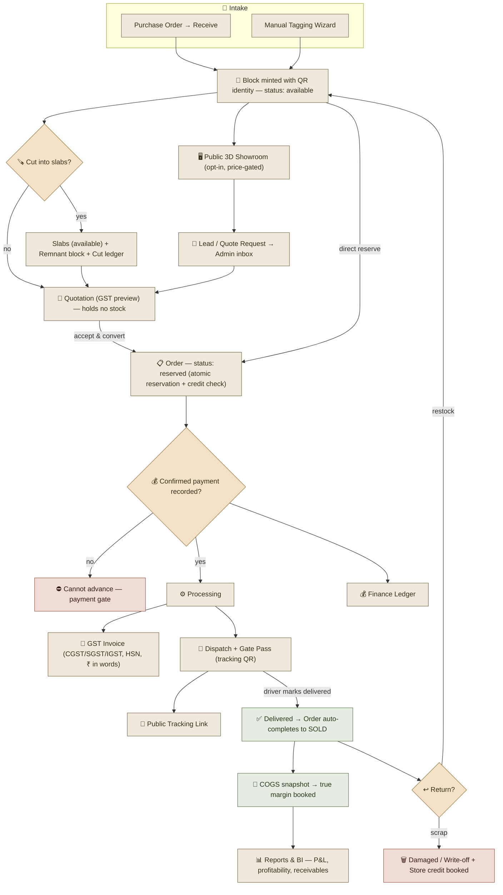

# 🪨 Product Overview — A Guided Tour of ShilaTeq

> A narrated demonstration of ShilaTeq (StoneX): what it is, who it's for, and how one platform carries a stone block all the way from the quarry truck to a delivered, GST-compliant invoice.

[← Back to Documentation Hub](README.md)

---

## 👋 Introduction

Imagine walking into a busy stone yard on the outskirts of Kishangarh or Rajkot. Thousands of marble and granite blocks sit in long rows under the sun, each one worth anywhere from tens of thousands to several lakhs of rupees. A buyer calls asking for "white marble, roughly nine by four feet, Grade A." The owner sends a worker to walk the rows with a phone camera, hunting. Meanwhile a ledger book records who paid what, a cutter chalk-marks a block before feeding it to the gangsaw, and three separate WhatsApp threads hold the only record of a pending order.

This is the world **ShilaTeq (StoneX)** was built for — and built to change.

ShilaTeq is a **mobile-first, multi-tenant ERP for stone yards**. One deployed platform serves many independent yards, each with its own isolated data. Within a yard, an **owner or supervisor** runs the full business from a phone or laptop, while **shop-floor workers** use a stripped-down, offline-capable, Hindi-and-English app to log real work. And out on the open web, **prospective buyers** browse a yard's stock in an interactive 3D showroom and request quotes — no login, no friction.

> This overview is written as a **product demonstration**. Follow along as we take a single stone block on its complete journey through the platform. For the exhaustive feature list, see [Features](02_Features.md); for the modules behind these capabilities, see [Modules](03_Modules.md).

## 🎯 Purpose

ShilaTeq exists to replace a paper-and-memory operating model with a **single digital source of truth** — one that is realistic for the actual environment of a stone yard: cheap Android phones, patchy connectivity, a Hindi-speaking workforce, and Indian GST commerce.

Concretely, the platform is designed to:

- **Give every block a permanent digital identity** the moment it arrives, so nothing is ever lost, mis-priced, or forgotten.
- **Run the entire sell-side lifecycle** — showroom, lead, quote, order, payment, invoice, dispatch, delivery, returns — in one connected flow.
- **Make true margin visible** by tracking real cost from purchase through cutting wastage to sale-time COGS.
- **Keep the shop floor working offline**, so a dropped signal never stalls a cut or a delivery.
- **Speak the worker's language**, with bilingual, icon- and number-first screens.
- **Handle India-native commerce** natively: GST splits, HSN codes, rupee amounts in words, and WhatsApp as the messaging layer.

## ⚙️ How the Product Works — The Life of a Stone Block

Let's follow one block, end to end. Each step below is a real capability a user touches.

### 1. 🚚 Intake — the block arrives and gets its identity

A truck arrives from the quarry. In ShilaTeq, blocks enter one of two ways:

- **Via a purchase order.** The supervisor raises a **purchase order** to a supplier through a short wizard. When the goods arrive, one tap on **Receive** turns each ordered line into a real inventory block — dimensions, stone type and variety, purchase cost, and status all carried across automatically. The block's cost basis is set from the moment it enters the yard.
- **Via manual tagging.** For walk-in or existing stock, a worker or supervisor uses the **tagging wizard** — a three-stage flow capturing dimensions, grade, finish, origin, up to five photos, and pricing.

Either way, the block is **minted with a QR code**. That QR is its permanent identity. Print an 80×110 mm label, stick it on the stone, and from now on anyone can scan it to pull up the block's digital record — even without logging in.

### 2. 🔍 Living in inventory — findable in seconds

The block now lives in the yard's **inventory directory**: searchable, filterable, and exportable. When that buyer calls asking for "white marble, nine by four, Grade A," the supervisor doesn't send anyone walking. They type the request into a **typo-tolerant search** that tolerates spelling slips on stone names but never on block codes, and the matching blocks surface instantly.

Behind the scenes, ShilaTeq is already watching this block's **age** — fresh, amber, or red — and estimating its **carrying cost** as it sits. Dead capital doesn't stay invisible.

### 3. 🖥️ On the showroom — turning the web into leads

If the owner opts this block in for public display, it appears in the yard's **public 3D showroom** — an interactive, WebGL-powered catalog at the yard's own web address. A prospective buyer like Priya browses polished stone tiles, opens a block, and sees either a price or a tasteful "On request." She fills a short form to **request a quote**, and that request lands instantly in the yard's **Leads inbox** as a new enquiry. A one-tap WhatsApp reply opens a pre-written message and advances the lead's status automatically.

> **💡 The showroom is a demand funnel, not a brochure.** Every browse can become a lead, and every lead can seed a quotation — all without the yard building or maintaining a website.

### 4. 🪚 Cutting — from block to slabs (the manufacturing step)

Many blocks don't sell whole; they're **cut into slabs** on a gangsaw. This is where most yards lose track of yield — and where ShilaTeq's **partial-cut engine** shines.

A cutter opens the block on the **worker app** (in Hindi if they prefer), enters how much of the block was consumed, and lists the slabs produced with their dimensions, thickness, finish, and grade. ShilaTeq then does the math a paper ledger never could:

- **Recovery %** — how much usable slab area came out of the input.
- **Wastage** — the material lost to the cut, which correctly **raises the unit cost** of the slabs produced.
- **Remnant block** — if usable stone remains, a new, instantly sellable **remnant block** is created automatically.
- **An immutable cut-event record** — so the yield of every cut is permanently on the books.

The parent block closes as "cut," its slabs enter inventory as available stock, and every rupee of cost is accounted for. Because the worker app is **offline-first**, the cutter can log all of this with no signal — the entry queues safely and syncs the moment connectivity returns, and can never be double-counted.

### 5. 🛒 Quotation — putting a price in front of the customer

The supervisor builds a **quotation** in a short wizard, adding blocks and slabs and rates. ShilaTeq shows a **live GST preview** so the customer sees the real, tax-inclusive number. Quotes deliberately **don't hold stock** — the same block can appear on several open quotes — and each quote carries a validity date.

The quote can be sent over **WhatsApp** with one tap. When the customer accepts, the supervisor **converts** it to an order.

### 6. 📋 Order & reservation — stock is now spoken for

Converting a quote (or building an order directly) creates an **order** and **reserves** its stock. Reservation is **atomic and safe**: if two supervisors try to sell the same block at the same moment, ShilaTeq guarantees only one succeeds — the other is cleanly told the block is no longer available, with nothing half-reserved. Reserved stock immediately disappears from every selector so it can't be double-sold.

At order creation, a **credit check** runs: the platform compares the customer's total outstanding exposure against their credit limit and warns the supervisor if the order would push them over — a soft gate that a manager can consciously override.

### 7. 💰 Payment — the gate that protects the yard

Here ShilaTeq enforces a simple, powerful rule: **an order cannot advance past "reserved" until at least one confirmed payment is recorded.** No payment, no processing, no dispatch. Payments are recorded manually — cash, UPI, card, or bank transfer — and the order's paid amount is always the exact sum of confirmed payments, never a number someone typed by hand.

If a customer has **store credit** (say, from an earlier return), it can be applied to the order and behaves exactly like cash — capped so it can never exceed either the available credit or what's actually owed.

### 8. 🧾 Invoice — GST compliance in one tap

Once the order is paid and progressing, the supervisor generates a **GST invoice**. ShilaTeq freezes a clean snapshot of the sale, applies the correct **CGST/SGST split** for an in-state sale or **IGST** for inter-state, stamps the **HSN code**, and even renders the total as **rupees in words** in the Indian lakh/crore convention. The printed invoice is a proper, self-contained tax document — and it carries a QR link back to the yard's showroom.

### 9. 🚛 Dispatch & gate pass — goods leave the yard

With payment confirmed, the supervisor creates a **dispatch**, capturing vehicle, transporter, driver, and e-way details. ShilaTeq prints a professional **gate pass / loading slip** with an embedded **tracking QR**, and moves the order to "shipped."

The supervisor assigns an **internal driver** — a worker with delivery access. On his phone, the driver (Vijay) sees **only his deliveries**, in his language, with two clear buttons: **Mark In Transit** and **Mark Delivered**.

### 10. 📍 Delivery & tracking — the customer follows along

The customer can follow the shipment on a **public tracking link** — no login — watching it move from dispatched to in-transit to delivered. When the driver marks the delivery complete, ShilaTeq **automatically completes the order to "sold."** That single event cascades: the stone is marked sold, the true **cost of goods is snapshotted** onto the order for honest margin, and the worker's assignment closes.

### 11. ↩️ Returns — handled with financial integrity

If goods come back, the supervisor processes a **return** against the sold order, choosing per line whether to **restock** good material (back into the sellable pool) or **scrap** damaged material (written off, never silently resold). ShilaTeq recomputes the order, books any **store credit** the customer is now owed — carefully, so repeated returns can never double-count — and records the write-off loss on the books.

The block's journey is complete — and every step of it, every rupee, and every hand that touched it is on the record.

## 👤 Primary Users

| User | Where they work | What they do in ShilaTeq |
|---|---|---|
| **Owner / Admin (Rajesh)** | Full platform, phone or desktop | Sees everything: stock, cash, margin, staff; sets policy (GST rate, credit terms, carrying cost) |
| **Supervisor / Manager (Sunil)** | Full admin app | The operational driver — quotes, orders, payments, dispatch, day-to-day running |
| **Worker / Cutter (Ramesh)** | Worker app, phone-only | Logs cutting output and task steps offline, in Hindi; checks own earnings and requests advances |
| **Driver (Vijay)** | Worker app, deliveries only | Sees only assigned deliveries; marks in-transit and delivered |
| **Prospective Buyer (Priya)** | Public showroom, no login | Browses stock, requests quotes |

See [User Roles](04_User_Roles.md) for exact permissions and [User Journeys](05_User_Journeys.md) for each persona's full path.

## 🎯 Core Business Goals

ShilaTeq is engineered to move a handful of numbers that matter to a yard owner:

- **🔎 Recover time and sales** — find any block in seconds instead of hours, and quote faster.
- **📈 Protect and reveal margin** — make cutting wastage and true COGS visible so nothing sells below cost by accident.
- **💵 Free up dead capital** — surface aged inventory and its carrying cost before it silently drains cash.
- **🛡️ Stop credit and payment leakage** — enforce credit limits, gate fulfilment behind payment, and track every rupee of exposure.
- **🌐 Win more demand** — convert web visitors into leads through an always-on public showroom.
- **✅ Simplify compliance** — turn GST invoicing and gate passes into one-tap actions.
- **👷 Run the shop floor reliably** — keep work flowing offline and in the worker's own language.

## 🔄 End-to-End Overview

The full lifecycle, from intake to delivered invoice and returns, in one picture:

> **Reading the flow:** Stone enters as **blocks** (received PO or manual tag) and is minted with a **QR identity**. Available blocks can appear in the **public showroom** (generating **leads**) and can be **cut into slabs** (plus a remnant and a permanent cut record). Blocks and slabs are **quoted**, then **reserved** onto an **order** — which cannot progress until a **confirmed payment** clears the gate. Paid orders generate a **GST invoice** and a **dispatch with gate pass**; when the driver marks delivery, the order **auto-completes to sold** and true **COGS is snapshotted**. **Returns** either restock or scrap-and-credit. Everything settles into the **finance ledger** and **reports**.

For the precise state machines and rules behind each transition, see [Business Workflows](07_Business_Workflows.md).

## 🤝 Why Organizations Would Adopt ShilaTeq

Stone yards don't adopt software because it's modern — they adopt it because it stops a specific bleed. ShilaTeq earns its place for reasons that map directly to a yard's P&L and daily reality:

- **It fits the yard, not the other way around.** No new hardware, no desktop-only assumptions, no English-only screens. It runs on the phones workers already carry, in the language they speak, and keeps working when the signal drops.
- **It models stone, not generic SKUs.** Volumetric pricing, cutting recovery, block-and-slab lifecycles, remnants, and carrying cost are first-class — not bolted onto a general inventory tool. 💡 *This domain depth is the single hardest thing for a horizontal ERP to replicate.*
- **It protects money at every step.** Payment gating, credit limits, store-credit ledgers, payment caps, and sale-time COGS mean fewer bad debts, fewer under-cost sales, and a margin number the owner can trust.
- **It turns compliance into a tap.** GST invoices, gate passes, and HSN handling that would otherwise take a clerk and a spreadsheet become single actions.
- **It creates demand, not just records it.** The public 3D showroom gives every yard an online presence and a lead funnel it would never build alone.
- **It's honest.** Unknown costs show as "N/A," not a fake margin; write-offs are recorded, not hidden; the platform's own limits (manual payments, WhatsApp-based messaging) are transparent rather than papered over.
- **It demos in seconds.** A zero-infrastructure demo mode means a prospect — or a new employee — can explore the whole product immediately, with realistic data, no setup.

> **The bottom line:** ShilaTeq lets an owner run a multi-crore business on evidence instead of memory — seeing exactly what they own, what it cost, who owes them, and what it's worth. For a deeper look at what sets it apart, continue to [Product Strengths](11_Product_Strengths.md), and for the honest roadmap, see [Product Opportunities](12_Product_Opportunities.md).

---

*Part of the **ShilaTeq (StoneX) Product Documentation Hub** — the operating system for stone yards.*
