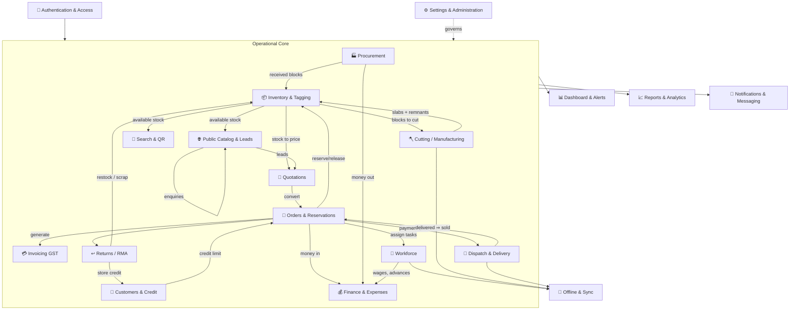

# 🧩 Logical Modules

> The functional building blocks of ShilaTeq (StoneX) — what each module does, who uses it, and how they connect into one operating system for the stone yard.

[← Back to Documentation Hub](README.md)

---

ShilaTeq (StoneX) is organised into **19 logical modules**. Each module is a coherent area of business responsibility — a bundle of related features that a user thinks of as "one part of the system." Modules are not isolated apps; they form a single pipeline where the output of one becomes the input of the next. Procurement fills Inventory; Inventory feeds Quotations and Orders; Orders drive Invoicing, Dispatch, and Finance; the Public Catalog feeds Leads, which feed Quotations again.

This page describes each module using a consistent structure:

- **Purpose** — the business problem it solves.
- **Features Included** — the capabilities it bundles (see [Features](02_Features.md) for full detail).
- **Business Responsibilities** — what the yard uses it to get done.
- **User Roles Involved** — who touches it (see [User Roles](04_User_Roles.md)).
- **Inputs** — what flows in.
- **Outputs** — what flows out.
- **Dependencies** — the modules it relies on or feeds.
- **Benefits** — the value it delivers.

> **💡 Tip:** Read the module map first — it shows the whole system at a glance, then dive into any module below.

---

## 🗺️ Module Map

How the modules connect. Solid arrows show the main flow of stone, money, and documents through the business; the shared layers (Authentication, Notifications, Offline & Sync, Settings) wrap around everything.

> **Note:** The **Driver** experience is not a separate module — it is the delivery slice of **Dispatch & Delivery** surfaced inside the worker app. Likewise **Offline & Sync** and **Notifications & Messaging** are cross-cutting layers that touch many modules rather than a single screen.

---

## 🔐 1. Authentication & Access

- **Purpose:** Let the right people in, keep everyone else out, and make sure every yard sees only its own data.
- **Features Included:** Email + password login for owners/managers; **username-only** login for shop-floor workers (no email or self-signup to remember); admin-provisioned worker accounts; automatic role detection (Admin vs Worker); role-based landing pages; per-yard data isolation.
- **Business Responsibilities:** Control who can view finances vs who can only log cutting; onboard a new worker in seconds; guarantee one yard's stock, customers, and cash are invisible to any other yard on the platform.
- **User Roles Involved:** Admin (provisions logins, logs in with email), Worker/Driver (logs in with username), Public/Guest (no login required for public surfaces). See [User Roles](04_User_Roles.md).
- **Inputs:** Login credentials; a worker's username created by an admin.
- **Outputs:** An authenticated session, a resolved role, and the correct landing page (`/dashboard` for admins, worker dashboard for workers).
- **Dependencies:** Underpins **every** other module — nothing operational is reachable without it. Worker accounts are created from the Workforce module.
- **Benefits:** ✅ Confirmed low-friction access for low-literacy staff (a username, nothing more); strong multi-tenant isolation so the platform is safe to run as shared SaaS; no password-reset burden for workers.

## 📊 2. Dashboard & Alerts

- **Purpose:** Give the owner a single "state of the business" screen the moment they open the app.
- **Features Included:** Live KPI tiles (stock value, receivables, cash position, orders in flight); an alerts engine that surfaces what needs attention today — overdue receivables, stock ready to dispatch, unmarked attendance, wages payable, ageing stock, low activity; one-tap action cards that jump straight to the relevant screen.
- **Business Responsibilities:** Tell the owner where money and stone are stuck; replace "the owner's memory" with a prioritised to-do list; prompt the daily rhythm of the yard.
- **User Roles Involved:** Admin only.
- **Inputs:** Live data from Inventory, Orders, Customers, Finance, Workforce, and Dispatch.
- **Outputs:** Ranked alerts and KPI figures; navigation shortcuts into the module that resolves each alert.
- **Dependencies:** Reads from nearly every operational module; pairs with **Notifications & Messaging** (the header bell runs a second, independent alerts engine).
- **Benefits:** ✅ Confirmed nothing important slips through the cracks; the owner starts each day knowing the three things that matter most.

## 📦 3. Inventory & Tagging

- **Purpose:** Give every stone block and slab a permanent digital identity and a single source of truth for location, dimensions, grade, cost, age, and status.
- **Features Included:** Block and slab directory with fast filters and CSV export; a **3-stage tagging wizard** that mints a QR code and captures photos the moment a block arrives; block detail with carrying-cost tracking, per-slab margin, and damage/write-off; a dedicated slab inventory with inline status changes; per-block lifetime P&L and stock-ageing buckets; catalog opt-in and share.
- **Business Responsibilities:** Know exactly what is in the yard, where it sits, what it cost, and whether it is available, reserved, sold, cut, or damaged — at any moment, from any phone.
- **User Roles Involved:** Admin (full CRUD, pricing, analytics); Worker (tags blocks in a simplified Hindi mode; selling price optional for workers).
- **Inputs:** Received blocks from Procurement; new slabs and remnants from Cutting; reservation/release signals from Orders; damage dispositions from Returns; manual tagging entries.
- **Outputs:** The available-stock pool consumed by Search, Catalog, Quotations, and Orders; QR labels; ageing and carrying-cost figures for Reports.
- **Dependencies:** Fed by **Procurement** and **Cutting**; consumed by **Quotations**, **Orders**, **Search & QR**, and **Public Catalog**; state changes ripple to **Finance** (stock value) and **Reports**.
- **Benefits:** ✅ Confirmed find any block in seconds; no more chalk marks and paper registers; accurate stock valuation and margin because cost travels with every block.

## 🪓 4. Cutting / Manufacturing

- **Purpose:** Turn raw blocks into saleable slabs on the gangsaw, and account honestly for yield, wastage, and remnants.
- **Features Included:** A **partial-cut engine** — the worker enters the area consumed and the slabs produced; the system computes recovery %, wastage, and recovery-adjusted slab cost (wastage correctly raises the unit cost of good slabs); automatic minting of slabs with copied metadata; an **immutable cut-event ledger**; automatic creation of a **remnant block** for any unused material (instantly saleable); the parent block always closes to a "cut" state.
- **Business Responsibilities:** Record what actually came off each block; recover value from off-cuts instead of losing them; cost slabs correctly so margins are real.
- **User Roles Involved:** Worker (executes the cut on the shop floor, offline-capable, pricing hidden); Admin (a legacy full-cut path and oversight).
- **Inputs:** An available block, the consumed area, and slab rows (length × width, thickness, finish, grade).
- **Outputs:** New slabs (available), an optional remnant block (available), a permanent cut-event record, and recovery/wastage metrics.
- **Dependencies:** Draws blocks from **Inventory** and returns slabs and remnants to **Inventory**; queues through **Offline & Sync**; recovery % surfaces in **Reports**.
- **Benefits:** ✅ Confirmed truthful yield accounting; off-cuts become revenue; a tamper-evident manufacturing history; safe on a patchy shop-floor connection (a double-tap or offline replay can never cut the same block twice).

## 🔎 5. Search & QR

- **Purpose:** Locate any block or slab instantly — by typing, or by pointing a phone camera at its QR code.
- **Features Included:** A **typo-tolerant unified finder** for blocks and slabs (fuzzy matching on names, exact matching on codes so similar codes never collide); camera **QR scanning** (native detector with a fallback for older browsers, rear-camera preference, manual-paste option); a public, safe QR "identity card" for any scanned block.
- **Business Responsibilities:** End the hunt for a specific stone in a crowded yard; let staff and customers verify a block's identity from its physical QR tag.
- **User Roles Involved:** Admin and Worker (full finder and scanner); Public/Guest (safe QR identity card only).
- **Inputs:** A search query, or a scanned/pasted QR code.
- **Outputs:** Matching blocks/slabs with their status and location; for the public, a safe subset of a block's details (no cost, supplier, or pricing).
- **Dependencies:** Reads the **Inventory** pool; the public QR card is a narrow, safe view (aligned with the Catalog's price-gating rules).
- **Benefits:** ✅ Confirmed seconds to find stone even with a typo; the physical QR tag bridges the yard floor and the digital record; customers can self-verify a block without exposing sensitive data.

## 📝 6. Quotations

- **Purpose:** Price and propose stock to a customer, then convert an accepted quote into an order — without ever locking stock prematurely.
- **Features Included:** A 3-step quotation wizard with GST preview; send / accept / reject / expire lifecycle; **quotes deliberately hold no stock** (the same block can appear on many drafts); one-click **convert-to-order** with a live re-check that every line is still available; WhatsApp share of the quote.
- **Business Responsibilities:** Respond to enquiries fast, keep pricing consistent, and avoid the classic error of promising one block to two customers.
- **User Roles Involved:** Admin only.
- **Inputs:** Selected available blocks/slabs and rates; a customer; leads from the Public Catalog.
- **Outputs:** A quotation document (shareable, GST-previewed); on conversion, a reserved order.
- **Dependencies:** Prices stock from **Inventory**; often begins from a **Public Catalog & Leads** enquiry; converts into **Orders & Reservations**; shares via **Notifications & Messaging**.
- **Benefits:** ✅ Confirmed faster, more professional quoting; no stock is frozen until a real order exists; a clean audit trail from enquiry to order.

## 🧾 7. Orders & Reservations

- **Purpose:** The commercial hub — reserve stock for a customer, take payment, and drive the order through processing, dispatch, and completion.
- **Features Included:** Order creation from a quote or directly (with a **credit-limit check**); a **safe reservation engine** that prevents double-booking under concurrent use; a payment-gated pipeline (**reserved → processing → shipped → sold**) where every step past "reserved" requires at least one confirmed payment; edit-while-reserved (add/remove lines with automatic re-reserve/release); embedded payments and store-credit application; a single order hub that also spawns the GST invoice, dispatch, and returns.
- **Business Responsibilities:** Hold the right stone for the right customer, enforce "money before goods move," and keep every order's status honest.
- **User Roles Involved:** Admin (runs the full pipeline); Worker (receives task assignments generated from an order).
- **Inputs:** Available stock, a customer (with a credit position), and confirmed payments.
- **Outputs:** Reserved/sold stock, an order pipeline state, worker task assignments, and triggers for invoicing, dispatch, and finance.
- **Dependencies:** Reserves from **Inventory**; checks **Customers & Credit**; created from **Quotations**; produces **Invoicing**, **Dispatch**, **Returns**, worker tasks in **Workforce**, and money-in for **Finance**.
- **Benefits:** ✅ Confirmed no double-selling of the same block; disciplined cash control (goods never ship unpaid); one screen to run an order end-to-end.

## 👥 8. Customers & Credit

- **Purpose:** Track who buys, how much they owe, how much credit they hold, and their history with the yard.
- **Features Included:** Customer directory with contact and GSTIN details; a **credit-limit** with live exposure (what they currently owe across open orders); a **store-credit ledger** (credit notes granted, credit applied, running balance); negotiation/history logs; WhatsApp payment reminders.
- **Business Responsibilities:** Decide how much to trust a customer, keep receivables under control, and hold customer money as usable store credit after returns.
- **User Roles Involved:** Admin only.
- **Inputs:** Customer details; order exposure from Orders; credit notes from Returns; payments from Finance.
- **Outputs:** A credit-limit signal that gates order creation; a store-credit balance applicable to future orders; receivables data for Reports and Finance.
- **Dependencies:** Feeds a soft credit gate into **Orders**; receives store credit from **Returns/RMA**; contributes receivables to **Finance** and **Reports & Analytics**.
- **Benefits:** ✅ Confirmed fewer bad debts through credit discipline; customer overpayments become spendable credit instead of awkward refunds; a full relationship history in one place.

## 💳 9. Invoicing (GST)

- **Purpose:** Produce compliant, India-native GST tax invoices — exactly one per order — with correct tax splits and printable output.
- **Features Included:** One-click GST invoice per order (uniqueness enforced); automatic **CGST/SGST vs IGST** determination via a place-of-supply toggle; HSN 6802 line coding; ₹ amount-in-words (Indian lakh/crore); a self-contained print layout with the live seller block and an embedded catalog QR; invoice list and reprint.
- **Business Responsibilities:** Meet GST compliance, bill customers accurately, and hand over a professional printed invoice.
- **User Roles Involved:** Admin only.
- **Inputs:** A sold/qualifying order, buyer GSTIN and state, the yard's GSTIN and GST rate from Settings.
- **Outputs:** A numbered GST invoice (frozen snapshot of line items) ready to print or reprint; tax figures for Finance and Reports.
- **Dependencies:** Generated from **Orders**; tax rate and seller details come from **Settings & Administration**; totals feed **Finance** and **Reports**.
- **Benefits:** ✅ Confirmed GST compliance without a separate accounting package; exact tax splits (the split is computed so halves always reconcile to the total); instant, professional invoices in the field.

## 🚚 10. Dispatch & Delivery

- **Purpose:** Move sold stone out of the yard under a gate pass, track it to the customer, and reconcile the order on delivery.
- **Features Included:** Dispatch/gate-pass creation (vehicle, transporter, driver, e-way, notes), payment- and status-gated; a printable **A4 Gate Pass / Loading Slip** with an embedded tracking QR and signature blocks; a **driver handoff** — the assigned worker sees only their deliveries and advances status forward only (In Transit → Delivered); a **public tracking page** by opaque token; automatic order completion to "sold" on delivery.
- **Business Responsibilities:** Control what leaves the gate, give the driver a simple job list, let the customer track delivery, and close the order automatically.
- **User Roles Involved:** Admin (creates and authorises dispatch); Worker acting as **Driver** (updates delivery status); Public/Guest (tracks by link, no prices).
- **Inputs:** A paid, processing/shipped order; a nominated internal driver; vehicle/transporter details.
- **Outputs:** A gate pass, a tracking link, delivery status updates, and — on delivery — a completed "sold" order with its stock marked sold.
- **Dependencies:** Gated by **Orders** (payment + status); assigns a driver from **Workforce**; completion cascades back into **Orders**, **Inventory** (stock → sold), and **Finance**.
- **Benefits:** ✅ Confirmed no goods leave without authorisation and a paper trail; the driver experience is dead-simple and multilingual; customers self-serve tracking; the order closes itself, no manual reconciliation.

## ↩️ 11. Returns / RMA

- **Purpose:** Handle returned stone correctly — restock the good, scrap the damaged, and settle the money.
- **Features Included:** Batch returns on **sold orders only**; per-line disposition — **Restock** (back to available) or **Scrap** (marked damaged, permanently out of the sellable pool, logged with reason and estimated loss); automatic order-total recomputation; a **store-credit note** for the customer covering only the newly created overpayment (repeat returns never double-count); COGS reversal for accurate P&L.
- **Business Responsibilities:** Take back stock without corrupting inventory or margins, and turn customer overpayment into fair store credit.
- **User Roles Involved:** Admin only.
- **Inputs:** A sold order and the lines being returned, each with a disposition.
- **Outputs:** Restocked or scrapped items; a damage log entry for scrap; a recomputed order; a store-credit note for the customer; write-off figures for Reports.
- **Dependencies:** Operates on **Orders**; updates **Inventory** (restock/scrap); grants credit to **Customers & Credit**; posts write-offs and COGS reversal to **Finance** and **Reports**.
- **Benefits:** ✅ Confirmed returns don't silently re-release stock or fake margins; scrapped stone is honestly written off; customers keep their money as store credit.

## 🏭 12. Procurement (Suppliers & Purchases)

- **Purpose:** Buy raw blocks from suppliers, receive them into inventory, and track what's owed.
- **Features Included:** Supplier directory with payables; a **purchase-order wizard**; one-click **receive**, which fans each PO line out into individual, QR-coded blocks in inventory (cost basis attached); supplier payment recording that keeps each PO's paid amount in sync.
- **Business Responsibilities:** Source stock, book payables, and land purchased blocks in the yard as trackable, costed inventory.
- **User Roles Involved:** Admin only.
- **Inputs:** Supplier details, purchase orders (stone type/variety, dimensions, quantity, price), and supplier payments.
- **Outputs:** New available blocks in Inventory (with purchase cost as their cost basis); payables and money-out records; supplier statements.
- **Dependencies:** The **origin** of the stone pipeline — feeds **Inventory**; supplier payments feed **Finance**; costs flow through into margin in **Reports**.
- **Benefits:** ✅ Confirmed every purchased block enters the system fully identified and costed the instant it's received; payables are always current; no gap between "bought" and "in stock."

## 👷 13. Workforce (Workers, Attendance, Payroll)

- **Purpose:** Manage the people — provision worker logins, run the attendance register, and calculate pay including piece-rate cutting and advances.
- **Features Included:** Worker directory and login provisioning; a calendar **attendance register** (present / half-day / absent) with **wage snapshots frozen at mark time** (later wage edits never rewrite history); advance requests with an approval flow; payroll cards computing net pay (wages minus advances and payouts); worker task assignment from orders.
- **Business Responsibilities:** Know who worked when, pay them correctly, control advances, and route shop-floor work to the right person.
- **User Roles Involved:** Admin (provisions logins, marks attendance, approves advances, runs payroll); Worker (self-service — views own attendance and earnings, requests advances).
- **Inputs:** Worker records, daily attendance marks, cutting/task output, and advance requests.
- **Outputs:** Worker logins (created via a secure provisioning step); payroll figures; advance and payout records for Finance; task assignments the worker sees on their dashboard.
- **Dependencies:** Creates logins used by **Authentication & Access**; receives task assignments from **Orders**; wages, advances, and payouts feed **Finance**; drivers are assigned from here into **Dispatch**.
- **Benefits:** ✅ Confirmed accurate, tamper-resistant payroll (frozen daily wages); workers self-serve their pay without seeing anyone else's; advances stay controlled.

## 💰 14. Finance & Expenses

- **Purpose:** Be the yard's cashbook — one unified ledger of every rupee in and out, plus categorised expenses.
- **Features Included:** A **unified in/out ledger** merging customer payments (in) with supplier payments, expenses, and wage advances/payouts (out); a cashbook with 8 expense categories; confirmed-only cash counting; WhatsApp payment reminders to customers; the store-credit mechanics that let applied credit fold into paid amounts exactly like cash.
- **Business Responsibilities:** Know the cash position, chase receivables, book expenses, and keep money-in and money-out reconciled in one place.
- **User Roles Involved:** Admin only.
- **Inputs:** Customer payments from Orders; supplier payments from Procurement; wages/advances from Workforce; manually entered expenses.
- **Outputs:** A single linked ledger, cash-position figures, receivables/payables, and reminder messages; source data for Reports.
- **Dependencies:** Aggregates money from **Orders**, **Procurement**, **Workforce**, and **Returns**; feeds **Reports & Analytics** and the **Dashboard**; sends via **Notifications & Messaging**.
- **Benefits:** ✅ Confirmed the whole business's cash flow on one screen; no separate cashbook to reconcile; receivables actively chased over WhatsApp.

## 🌐 15. Public Catalog & Leads

- **Purpose:** Turn web visitors into enquiries — a public 3D showroom of the yard's available stock, and an inbox for the leads it generates.
- **Features Included:** A per-yard **public 3D showroom** (no login) showing only available stock, with **per-block price gating** ("On request" unless the block is opted-in to show its price); safe columns only (no cost, supplier, or exact location); a **quote-request** form (name, phone, quantity, message) that lands as a lead; a **Leads inbox** (new / contacted / closed) where a WhatsApp reply auto-advances the lead's status; shareable catalog links that unfurl into rich preview cards.
- **Business Responsibilities:** Market the yard online without a separate website, capture demand, and convert it into quotes.
- **User Roles Involved:** Public/Guest (browses, submits enquiries); Admin (manages the inbox, opts blocks into public pricing, replies).
- **Inputs:** The available-stock pool from Inventory; visitor enquiries.
- **Outputs:** Public showroom pages; leads in the admin inbox; enquiries that seed Quotations.
- **Dependencies:** Displays a safe, gated view of **Inventory**; feeds **Leads** which feed **Quotations**; replies go through **Notifications & Messaging**.
- **Benefits:** ✅ Confirmed a marketing storefront with zero extra tooling; sensitive pricing stays private per block; every enquiry is captured and worked, not lost in WhatsApp.

## 📈 16. Reports & Analytics

- **Purpose:** Turn the yard's raw activity into business intelligence — profitability, sales, inventory health, and receivables.
- **Features Included:** A **5-tab BI suite** (P&L, Sales, Inventory, Profitability, Receivables) with KPIs, period-over-period deltas, sparklines, and plain-language insights; date-range presets; **snapshot-aware COGS** (uses sale-time cost so later price edits don't rewrite history); ageing buckets, DSO, sell-through, and gangsaw recovery %; exports to PDF, Excel, CSV, PNG, and print.
- **Business Responsibilities:** Answer "are we making money, on what, and who owes us" — with numbers the owner can trust and share.
- **User Roles Involved:** Admin only.
- **Inputs:** Data from Inventory, Orders, Invoicing, Finance, Returns, Workforce, and Cutting.
- **Outputs:** Dashboards, insight strips, and exportable reports (PDF/Excel/CSV/PNG).
- **Dependencies:** A read-only consumer of nearly every operational module; complements the **Dashboard** (at-a-glance) with depth.
- **Benefits:** ✅ Confirmed real margins (not fake ones — unknown cost shows "N/A," never 100%); board-ready exports; insight without a spreadsheet analyst.

## 🔔 17. Notifications & Messaging

- **Purpose:** Make sure the right message reaches the right person — in-app alerts, and WhatsApp to customers.
- **Features Included:** A header **notifications bell** with a severity-ranked alerts engine (leads, ageing stock, receivables, POs, payables, stale reservations); in-app toasts; **WhatsApp as the messaging layer** — zero-API deep links with 5 typed templates (quotation, invoice, dispatch + tracking, lead reply, payment reminder); customer-facing messages append a catalog promo footer; live in-app sync so lists refresh without a manual reload.
- **Business Responsibilities:** Prompt action inside the app and communicate with customers on the channel they already use.
- **User Roles Involved:** Admin (bell, toasts, all WhatsApp templates); Worker (in-app toasts and status confirmations); customers receive the WhatsApp messages.
- **Inputs:** Business events (new leads, overdue receivables, dispatches) and the documents/data to message about.
- **Outputs:** Ranked in-app alerts, transient toasts, and pre-filled WhatsApp messages.
- **Dependencies:** Reads events from most operational modules; pairs with the **Dashboard** alerts engine; the customer-facing side is used by **Quotations, Invoicing, Dispatch, Leads, and Finance**.
- **Benefits:** ✅ Confirmed no integration cost for messaging (uses WhatsApp deep links); consistent, professional customer communication; the team is nudged toward the next action.
- **⚠️ Limitation:** There is no email channel — customer messaging is WhatsApp and in-app only. See [Opportunities](12_Product_Opportunities.md).

## 📴 18. Offline & Sync

- **Purpose:** Keep the worker app working when the internet doesn't — the shop floor and yard often have no signal.
- **Features Included:** An **offline outbox** for worker actions (cutting, task steps, deliveries); optimistic UI (the screen updates immediately); automatic, ordered, conflict-aware background sync when connectivity returns; **idempotent** queuing so a double-tap or replay can never apply an action twice; a **sync status chip** (Synced / syncing / not synced) and a sheet listing any stuck items with Retry and Clear; live in-app data refresh across tabs.
- **Business Responsibilities:** Never lose a worker's progress to a dropped connection; keep the digital record and the physical work in step.
- **User Roles Involved:** Worker/Driver (the primary beneficiaries — offline queuing on cutting, tasks, and deliveries); Admin (benefits from live cross-tab refresh).
- **Inputs:** Worker actions performed with or without connectivity.
- **Outputs:** Confirmed writes once online; a clear sync status; safe conflict handling (a stale action is dropped, never allowed to clobber fresher state).
- **Dependencies:** Wraps **Cutting**, **Workforce** tasks, and **Dispatch** deliveries; underlies the live-sync behaviour felt across the whole app.
- **Benefits:** ✅ Confirmed the worker app is trustworthy on a bad connection; progress is saved and syncs automatically; concurrency conflicts are handled safely, not silently corrupted.
- **⚠️ Limitation:** The **admin** app is not offline-cached — admin pages need a connection to first load. Worker actions are the offline-hardened path.

## ⚙️ 19. Settings & Administration

- **Purpose:** Configure the yard's identity, tax, and operating thresholds — the knobs that tune the rest of the platform.
- **Features Included:** Yard profile (name, contact, address, catalog slug); GSTIN and GST rate; carrying-cost rate; stock-ageing thresholds (amber/red); demo-data reset for evaluation; the settings that seed invoices, catalog, carrying cost, and alerts.
- **Business Responsibilities:** Set the yard up correctly once so invoices, catalog, costing, and alerts all behave to the yard's own rules.
- **User Roles Involved:** Admin only.
- **Inputs:** Yard details, GST configuration, cost and ageing parameters.
- **Outputs:** Configuration consumed across the platform — GST math in Invoicing, seller block on prints, catalog slug for the showroom, carrying-cost in Inventory, ageing thresholds in Dashboard/Reports.
- **Dependencies:** Governs **Invoicing**, **Public Catalog**, **Inventory** (carrying cost), and **Dashboard/Reports** (ageing thresholds).
- **Benefits:** ✅ Confirmed one place to configure the whole system; correct GST and branding on every document; alerts and costing tuned to each yard.

---

## 🔗 Module Interaction Summary

| Producer module | Hands off to | What flows |
|---|---|---|
| 🏭 Procurement | 📦 Inventory | Received, QR-coded, costed blocks |
| 📦 Inventory | 🪓 Cutting | Blocks to cut |
| 🪓 Cutting | 📦 Inventory | New slabs + remnant blocks |
| 📦 Inventory | 🌐 Catalog · 🔎 Search · 📝 Quotations · 🧾 Orders | Available stock (price-gated for public) |
| 🌐 Catalog & Leads | 📝 Quotations | Captured enquiries |
| 📝 Quotations | 🧾 Orders | Converted, reserved orders |
| 👥 Customers & Credit | 🧾 Orders | Credit-limit gate |
| 🧾 Orders | 💳 Invoicing · 🚚 Dispatch · ↩️ Returns · 💰 Finance · 👷 Workforce | Invoices, dispatch, RMAs, money-in, tasks |
| 🚚 Dispatch | 🧾 Orders · 📦 Inventory | Delivery ⇒ order sold, stock sold |
| ↩️ Returns | 📦 Inventory · 👥 Customers | Restock/scrap, store credit |
| 💰 Finance + all | 📈 Reports · 📊 Dashboard | Cash, margin, KPIs, alerts |

> **Note:** For the individual capabilities inside each module, see [Features](02_Features.md). For who can touch each module, see [User Roles](04_User_Roles.md). For the step-by-step flows between them, see [Business Workflows](07_Business_Workflows.md).

---

*Part of the **ShilaTeq Product Documentation Hub**. ShilaTeq is the operating system for stone yards.*
