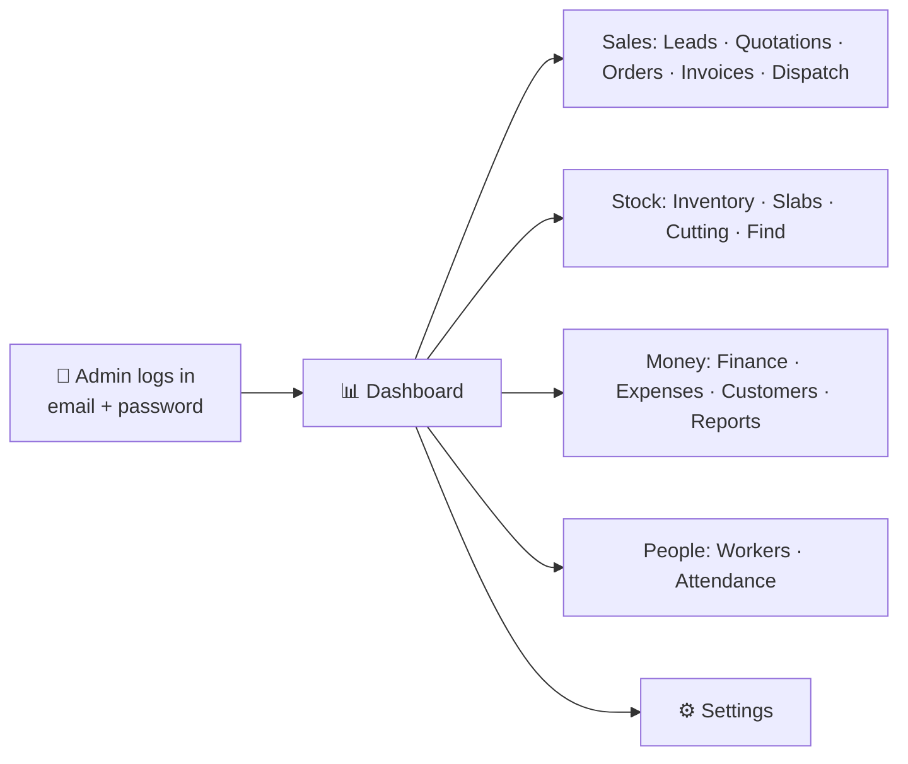
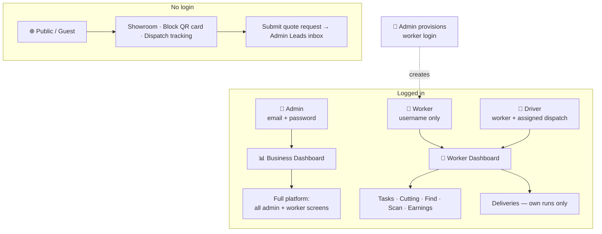

# 👤 User Roles & Permissions

> Who uses ShilaTeq (StoneX), what each role can do, and how each yard's data stays private — explained in plain business terms.

[← Back to Documentation Hub](README.md)

---

ShilaTeq (StoneX) is built around **four actor types**: the **Admin (Owner)** who runs the business, the **Worker** on the shop floor, the **Driver** (a worker on a delivery run), and the **Public/Guest** who browses the online showroom. Only two of these are true login roles — Admin and Worker. "Driver" is simply a worker assigned to a delivery, and "Public" is anyone who hasn't logged in.

The platform automatically works out a person's role the moment they sign in and sends them to the right home screen — the owner lands on the business Dashboard; a worker lands on the simplified worker Dashboard. Access is enforced twice over: the app hides screens a role shouldn't see, and the backend independently refuses data a role isn't entitled to. ✅ Confirmed.

> **💡 Tip:** For what each area of the platform actually does, see [Modules](03_Modules.md) and [Features](02_Features.md).

---

## 🧭 Role at a Glance

| Role | How you get it | How you log in | Lands on | What you can reach |
|---|---|---|---|---|
| **Admin (Owner)** | You own a yard, or an owner adds you as an admin member | Email + password | Business Dashboard | The entire platform (all admin areas **and** all worker screens) |
| **Worker** | An admin creates your account from the Workers page | **Username only** — no email, no password to remember at signup | Worker Dashboard | 7 worker screens (tasks, cutting, deliveries, earnings, find, scan) |
| **Driver** | A worker whom an admin assigns to a specific delivery | Same as worker | Worker Dashboard | Worker screens; sees **only their own** assigned deliveries |
| **Public / Guest** | No account — just a link | No login | — | The public showroom, a block's QR identity card, and delivery tracking |

> **Note:** There is **no self-signup**. Owner accounts are provisioned when a yard is onboarded; worker accounts are created by their own admin. This is deliberate — it keeps a controlled, invite-only user base per yard. ✅ Confirmed. See [Opportunities](12_Product_Opportunities.md) for the trade-off.

---

## 👑 Admin (Yard Owner / Manager)

- **Description:** The primary user and buyer — the yard owner (persona *Rajesh*) or a trusted manager/supervisor (persona *Sunil*). Runs the whole business from a phone or desktop.
- **Responsibilities:** Keep stock and pricing accurate; source and receive purchases; quote and close orders; take payments and control credit; authorise dispatch; run payroll and approve advances; stay GST-compliant; watch cash and margin; provision and manage worker logins.
- **Permissions:** Full read and write across their own yard — inventory, sales, procurement, finance, workforce, dispatch, reporting, and settings. Can create and remove worker logins, override credit-limit warnings, process returns, grant/apply store credit, and reset demo data.
- **Accessible modules:** **Every** module — Authentication & Access, Dashboard & Alerts, Inventory & Tagging, Cutting/Manufacturing, Search & QR, Quotations, Orders & Reservations, Customers & Credit, Invoicing (GST), Dispatch & Delivery, Returns/RMA, Procurement, Workforce, Finance & Expenses, Public Catalog & Leads, Reports & Analytics, Notifications & Messaging, Offline & Sync, and Settings & Administration — **plus** all worker screens. See [Modules](03_Modules.md).
- **Restrictions:** Cannot see or touch **any other yard's** data (enforced by per-yard isolation). Cannot self-sign-up. Cannot directly call the privileged account-provisioning routines — worker logins are created through a controlled, secure process, not raw database access.
- **Typical daily workflow:**
  1. Open the **Dashboard** — scan KPIs and today's alerts (overdue receivables, stock ready to dispatch, unmarked attendance, wages payable).
  2. Work the **Leads** inbox and reply to enquiries over WhatsApp.
  3. Turn accepted **Quotations** into **Orders**, checking each customer's credit position.
  4. Record **payments**, then release paid orders into processing and **Dispatch** with a gate pass.
  5. Mark **Attendance**, approve any **advance** requests.
  6. Receive incoming **Purchases** into inventory.
  7. Glance at **Reports** for margin and receivables before closing up.

## 👷 Worker (Shop-floor / Cutter)

- **Description:** The person doing the physical work (persona *Ramesh*) — often phone-only, low-literacy, working in Hindi. The worker app is deliberately icon- and number-first, **bilingual (English / हिंदी)**, and **offline-first**.
- **Responsibilities:** Cut blocks into slabs accurately (recording area consumed vs slabs produced); complete assigned multi-step task checklists; update deliveries when acting as a driver; keep an eye on their own attendance and earnings; request wage advances.
- **Permissions:** Read their **own** profile, attendance, earnings, and assignments; write their **own** cutting output and task-step progress; submit advance requests. Everything is scoped to the individual worker.
- **Accessible modules (7 worker screens):** Worker Dashboard (with offline sync status), Task progress checklist, Cutting screen, Deliveries, Earnings, Worker Find, and the QR Scanner. See [Modules](03_Modules.md).
- **Restrictions:** **No access to any admin area** — no finances, customers, procurement, pricing, or settings. **Pricing is hidden** on the cutting screen. Cannot see other workers' pay, other drivers' deliveries, or any other yard's data.
- **Typical daily workflow:**
  1. Open the **Worker Dashboard**, set status to available, review **My Work**.
  2. Open an assigned **Task** and tick off steps as they go (works offline; syncs automatically).
  3. On the **Cutting** screen, enter the block consumed and the slabs produced — the system handles yield and costing behind the scenes.
  4. If assigned a delivery, open **Deliveries** and advance it In Transit → Delivered.
  5. Check **Earnings**; request an **advance** if needed.
  6. Use **Scan** / **Find** to locate a block on the yard floor.

## 🚚 Driver (Delivery)

- **Description:** Not a separate account type — a **worker** (persona *Vijay*) whom an admin has assigned to a specific dispatch. The delivery experience lives inside the same worker app.
- **Responsibilities:** Take a dispatched order from the yard to the customer and keep its status current.
- **Permissions:** On the **Deliveries** screen, advance a dispatch **forward only** — Mark In Transit, then Mark Delivered. Marking a dispatch delivered automatically completes the order (it becomes "sold") — no admin action needed.
- **Accessible modules:** The worker screens, but the Deliveries list shows **only the dispatches where they are the assigned driver**. ✅ Confirmed.
- **Restrictions:** Sees **no pricing**, **no other drivers' deliveries**, and cannot move a status backward. Everything else about the worker restrictions applies.
- **Typical daily workflow:**
  1. Open **Deliveries** — see only today's assigned runs.
  2. Load the vehicle against the **gate pass**; Mark In Transit.
  3. Deliver to the customer; Mark Delivered — the order closes itself.

## 🌐 Public / Guest (Prospective Buyer)

- **Description:** Anyone without a login (persona *Priya*, a prospective buyer) reaching the yard's public surfaces via a shared link, a QR tag, or a tracking link.
- **Responsibilities:** None — this is a visitor. The business goal is to convert them into a **lead**.
- **Permissions:** Browse the yard's **public 3D showroom**, view a scanned block's **safe identity card**, and **track a dispatch** by its link. Can submit a **quote request** (name, phone, quantity, message) which becomes an admin lead. May advance a delivery's public status via the tracking link where permitted.
- **Accessible surfaces (no login):**
  - **Public Catalog / showroom** — shows **only available** stock and only safe details. A block's price appears **only if the yard opted that block in**; otherwise it reads *"On request."*
  - **Block QR identity card** — a safe view of a scanned block (no cost, supplier, or pricing).
  - **Dispatch tracking** — delivery progress by opaque token (safe fields, no prices).
- **Restrictions:** No account and no direct access to any business data. Cannot see reserved, sold, cut, or damaged stock; cannot see cost, supplier, exact yard location, or any financial or customer information. Every public view is a deliberately narrow, safe window. ✅ Confirmed.
- **Typical workflow:**
  1. Open a shared **catalog** link (unfurls into a rich preview card).
  2. Browse available stone; prices show or read "On request" per block.
  3. Submit a **quote request** → it lands in the admin **Leads** inbox → admin replies over WhatsApp.

---

## 🔐 Multi-Tenant Model — In Plain Business Terms

ShilaTeq is shared SaaS: many stone yards run on the same platform, yet each yard is a sealed box. ✅ Confirmed.

- **Each yard's data is completely isolated.** One yard can never see another yard's stock, customers, orders, cash, or staff. Every record belongs to exactly one yard, and the backend refuses to return a record to anyone outside that yard — this is enforced on the server, not just hidden in the app.
- **Workers see only their own slice.** A worker sees their own tasks, their own attendance, and their own earnings — never a colleague's pay or another worker's assignments.
- **Drivers see only their own deliveries.** A driver's Deliveries list is filtered to the dispatches assigned to them.
- **The public sees only what's meant to be public.** Visitors get available stock with safe details only, and a block's price is shown only when the yard has explicitly opted that block in. No cost, supplier, customer, or financial data is ever exposed.
- **Access is layered.** The app hides screens a role shouldn't reach, and independently, the backend enforces the same boundaries on the data itself — so a boundary can't be bypassed by poking at the app.

> **Note:** Because there is no self-signup, the user base of each yard is invite-only and controlled by that yard's owner — a further layer of tenancy discipline.

---

## ✅ Permissions Matrix

**Legend:** ✅ Full access · 🟡 Own records only (self-service / self-scoped) · ❌ No access · 🌐 Public safe-view (limited, non-sensitive)

| Capability / Area | 👑 Admin | 👷 Worker | 🚚 Driver | 🌐 Public |
|---|:--:|:--:|:--:|:--:|
| **Log in** | ✅ email + password | ✅ username only | ✅ username only | ❌ (no login) |
| **Dashboard & Alerts** | ✅ | ❌ | ❌ | ❌ |
| **Reports & Analytics** | ✅ | ❌ | ❌ | ❌ |
| **Inventory & Tagging** | ✅ | ❌ * | ❌ | ❌ |
| **Slabs** | ✅ | ❌ | ❌ | ❌ |
| **Cutting / Manufacturing** | ✅ | 🟡 own assigned cuts | 🟡 own | ❌ |
| **Search & QR (internal)** | ✅ | ✅ | ✅ | ❌ |
| **Quotations** | ✅ | ❌ | ❌ | ❌ |
| **Orders & Reservations** | ✅ | ❌ | ❌ | ❌ |
| **Customers & Credit** | ✅ | ❌ | ❌ | ❌ |
| **Invoicing (GST)** | ✅ | ❌ | ❌ | ❌ |
| **Dispatch — create / authorise** | ✅ | ❌ | ❌ | ❌ |
| **Dispatch — deliver (status advance)** | ✅ | 🟡 own deliveries | 🟡 own deliveries | ❌ |
| **Returns / RMA** | ✅ | ❌ | ❌ | ❌ |
| **Procurement (Suppliers & Purchases)** | ✅ | ❌ | ❌ | ❌ |
| **Workforce — manage (provision, payroll)** | ✅ | ❌ | ❌ | ❌ |
| **Attendance & Earnings — own** | ✅ | 🟡 own | 🟡 own | ❌ |
| **Request wage advance** | ✅ | 🟡 own | 🟡 own | ❌ |
| **Approve wage advance** | ✅ | ❌ | ❌ | ❌ |
| **Finance & Expenses** | ✅ | ❌ | ❌ | ❌ |
| **Leads inbox (manage)** | ✅ | ❌ | ❌ | ❌ |
| **Settings & Administration** | ✅ | ❌ | ❌ | ❌ |
| **Provision worker logins** | ✅ | ❌ | ❌ | ❌ |
| **Override credit-limit warning** | ✅ | ❌ | ❌ | ❌ |
| **See pricing / cost / margin** | ✅ | ❌ (hidden) | ❌ (hidden) | 🟡 opted-in prices only |
| **Public Catalog / showroom** | 🌐 | 🌐 | 🌐 | 🌐 |
| **Submit a quote request (lead)** | 🌐 | 🌐 | 🌐 | 🌐 |
| **Block QR identity card** | 🌐 | 🌐 | 🌐 | 🌐 |
| **Public dispatch tracking** | 🌐 | 🌐 | 🌐 | 🌐 |
| **See another yard's data** | ❌ | ❌ | ❌ | ❌ |

> `*` **Inventory tagging by workers:** the platform includes a simplified, Hindi worker mode for tagging a newly arrived block; in the current build the tagging screen is routed as admin-only, so day-to-day tagging is an admin action. 💡 Inferred from current routing. The worker's core write paths are cutting, task steps, and deliveries.

> **Note:** "Admin" columns show ✅ on worker rows because an admin account can also open the worker screens. In normal operation, admins run the business screens and workers run the shop-floor screens.

---

## 🗺️ Role → Landing → Surface

How each role enters the platform and what they can reach.

---

## 📌 Key Points to Remember

- **Two real roles, four experiences.** Admin and Worker are the login roles; Driver and Public are variations on them.
- **Workers log in with just a username.** No email, no self-signup — an admin creates the account. Low friction for low-literacy, phone-only staff. ✅ Confirmed.
- **Everything a worker sees is their own.** Own tasks, own pay, own deliveries — and no pricing.
- **The public sees a safe, gated window.** Available stock only, prices per-block opt-in, zero sensitive data.
- **Yards are sealed from each other.** Multi-tenant isolation is enforced on the server, so shared SaaS is still private.

> For the workflows these roles perform step by step, see [Business Workflows](07_Business_Workflows.md) and [User Journeys](05_User_Journeys.md).

---

*Part of the **ShilaTeq Product Documentation Hub**. ShilaTeq is the operating system for stone yards.*
