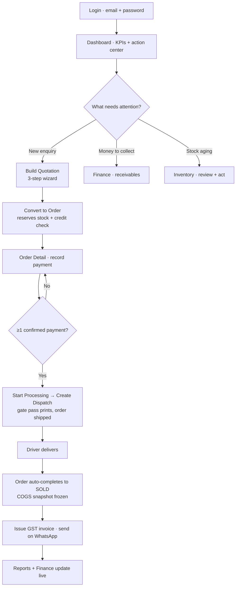
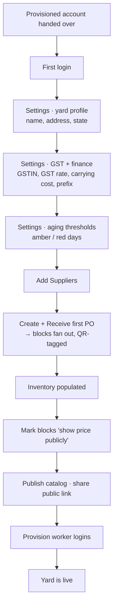
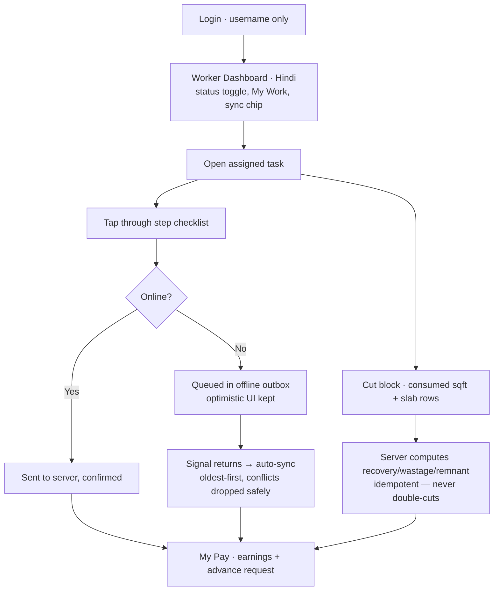
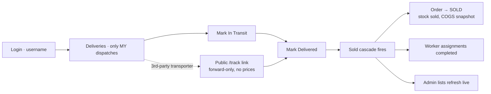
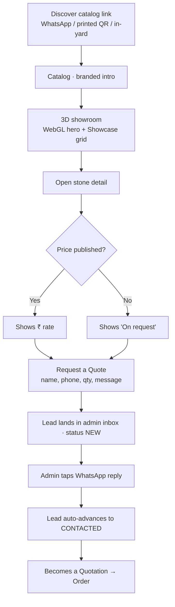
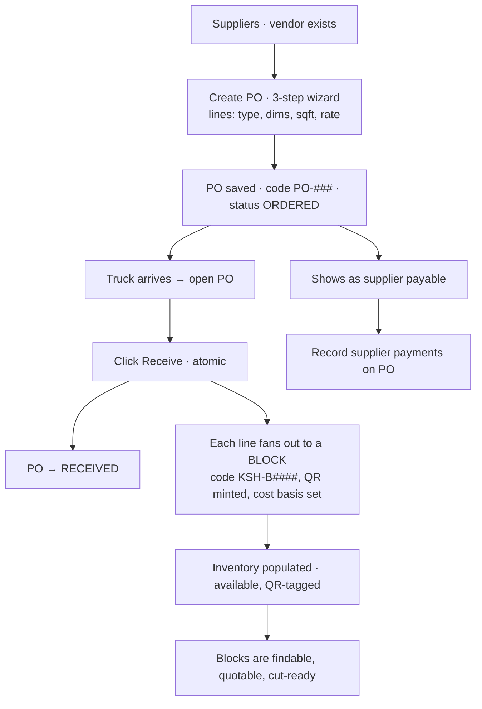
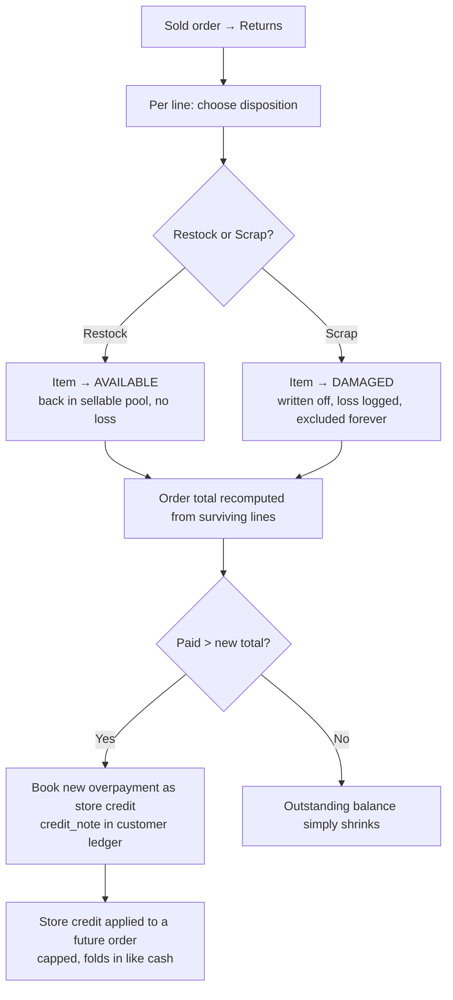
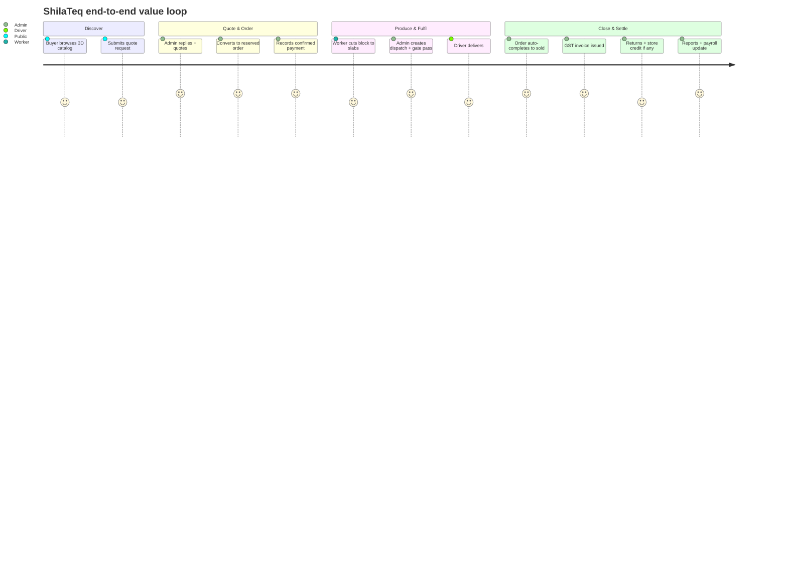

# 🧭 User Journeys

> Realistic, end-to-end journeys through **ShilaTeq (StoneX)** — from a first login to a delivered, invoiced, and (sometimes) returned order — each with a flow diagram and the value it delivers.

[← Back to Documentation Hub](README.md)

---

ShilaTeq is used by very different people on very different devices: an owner scanning receivables on a laptop, a supervisor building a quote, a cutter tapping through a task on a ₹6,000 phone with no signal, a driver marking a delivery from the highway, and a prospective buyer browsing a 3D showroom shared over WhatsApp. This document walks each of them through a complete, realistic journey.

Each journey has three parts: a short **narrative** of what actually happens, a **flow diagram**, and a **value delivered** note. Where a claim is directly supported by the platform's behaviour it is marked **✅ Confirmed**; where it is a reasonable product-level interpretation it is marked **💡 Inferred**.

**Related reading:** [User Roles](04_User_Roles.md) · [Features](02_Features.md) · [Screens & Pages](06_Screens_and_Pages.md) · [Business Workflows](07_Business_Workflows.md)

### Journeys in this document

| # | Journey | Primary actor | Starts at | Ends at |
|---|---|---|---|---|
| 1 | Daily operations — quote to delivered invoice | Owner / Admin (Rajesh, Sunil) | Login | Order sold + GST invoice |
| 2 | New yard onboarding & account setup | Owner / Admin | Provisioned account | Live catalog + first stock |
| 3 | Shop-floor cutting task (offline-first) | Worker (Ramesh) | Username login | Earnings updated |
| 4 | Delivery run | Driver (Vijay) | Login | Order auto-completes |
| 5 | Public buyer → lead → reply | Prospective buyer (Priya) | Catalog link | WhatsApp conversation |
| 6 | Procurement to stock | Supervisor / Admin | Create PO | QR-tagged blocks in yard |
| 7 | Returns / RMA | Owner / Admin | Sold order | Restock/scrap + store credit |

---

## 1. 🏢 Yard Owner / Admin — a day in the life

**Persona:** Rajesh (owner) or Sunil (supervisor). **Device:** phone or laptop. **Goal:** run the whole business off one screen — see what needs attention, then move money and stone through the pipeline.

**Narrative.** Rajesh signs in with email and password and lands on the **Dashboard**. Before he does anything, the screen has already triaged his day: a *"Needs your attention"* action center lists the things that actually matter today — payments overdue past 30 days, orders ready to dispatch, deliveries in transit, blocks that have aged past his amber/red thresholds, written-off stock, unmarked attendance, wages and supplier bills payable, and purchase orders waiting to be received. Four hero KPIs sit above it: **To Collect**, **To Pay**, **Stock Value**, and **Sales this month**, each a tappable shortcut. ✅ Confirmed

He works the pipeline top to bottom. A new enquiry needs a **Quotation**, so he builds one in the 3-step wizard (quotes hold no stock — the same block can sit on several drafts) and converts the accepted quote into an **Order**, which atomically **reserves** the chosen blocks and runs a soft **credit-limit check**. On the **Order Detail** hub he records the customer's advance **payment** — and only now does the pipeline unlock: with at least one confirmed payment on file he can **Start Processing** and **Create Dispatch**, which prints a **gate pass** and moves the order to *shipped*. When the driver marks the delivery done, the order **auto-completes to sold**, a **COGS snapshot** is frozen onto each line, and a one-click **GST invoice** is available. He closes the day glancing at **Finance**, **Reports**, and the **Attendance** register. ✅ Confirmed

> **💰 Value delivered:** One screen replaces the owner's memory, a paper register, and a pile of WhatsApp photos. The **payment gate** enforces a simple, unbreakable rule — *no stock moves until money is confirmed* — so the business never ships on an unpaid promise. ✅ Confirmed

---

## 2. 🚀 New Yard Onboarding & Account Setup

**Persona:** a newly signed customer. **Goal:** go from an empty, provisioned account to a live catalog with real stock in it. Because ShilaTeq does not offer owner self-signup, the yard account is **provisioned externally** and handed over ready to log in. ✅ Confirmed

**Narrative.** On first login the owner opens **Settings** and completes the yard's identity: yard name, owner name, address, city, and **state** (the state doubles as the GST place-of-supply that decides CGST/SGST vs IGST). They set the **block-code prefix** (e.g. `KSH`, which produces codes like `KSH-B0001`), the **Seller GSTIN** and **default GST rate** (18% for worked stone, HSN 6802), the **carrying-cost rate** used to estimate the cost of holding aged stock, a default **processing cost** per sqft, and the **inventory-aging thresholds** (amber after N days, red after N days) that drive colour-coding and alerts everywhere. ✅ Confirmed

Next they add **Suppliers**, raise a first **Purchase Order**, and **receive** it — which fans each PO line out into QR-tagged blocks, instantly populating **Inventory** (see Journey 6). To sell online, they mark blocks with *show price publicly* where they choose, then **publish the catalog**: every yard gets an auto-minted public slug, and the **Catalog** button copies/shares the showroom link. Finally they provision **worker logins** from the Workers page so the shop floor can start using the app. ✅ Confirmed

> **⚙️ Value delivered:** A structured setup means every downstream calculation — GST split, aging alerts, carrying cost, block codes, per-block margin — is correct from day one. The yard goes from empty to *sell-ready* (real stock, a public showroom, and staff logins) without touching a spreadsheet. ✅ Confirmed

> **⚠️ Limitation:** There is no self-service signup or onboarding wizard; the account and its owner login are created for the customer, and setup is completed manually in Settings. 💡 Inferred

---

## 3. 🔨 Shop-floor Worker — an offline-first cutting task

**Persona:** Ramesh, a gangsaw operator. **Device:** a cheap Android phone, often with no signal in the shed. **Language:** Hindi. **Goal:** do his assigned work and see that it counted.

**Narrative.** Ramesh logs in with **just a username** — no email, no password to memorise. His **Worker Dashboard** greets him in Hindi (a one-tap EN/हिं toggle is always visible), shows a big three-way **status toggle** (Available · Busy · Off), simple stat tiles (active jobs, done today, pending steps, progress), his list of assigned jobs under *My Work*, and a running tally of slabs he's cut. A bold **sync chip** — green *Synced*, amber *N syncing*, red *N not synced* — tells him at a glance whether his work is safe. ✅ Confirmed

He opens an assigned job and taps through an **offline-first step checklist**. Every tap is applied instantly on his screen and queued locally; a banner reassures him *"Offline — your progress is saved and will sync automatically."* When he cuts a block on the **Cut** screen, he enters how much of the block he consumed and adds a row per slab (length × width, thickness, finish, grade) — pricing is completely hidden from him. The platform computes recovery %, wastage, and remnant server-side, and an **idempotency key** guarantees a double-tap or an offline replay can *never* cut the same block twice. When signal returns, the queue **drains oldest-first**; anything that conflicts (someone else moved the record) is safely dropped rather than clobbering fresher state. He checks **My Pay** to see attendance, earnings, and can request an advance. ✅ Confirmed

> **📱 Value delivered:** A low-literacy, Hindi-first, icon-and-number UI plus a rock-solid **offline outbox** means work is never lost to a dead zone and never double-counted. The worker sees only what he needs — his tasks, his cuts, his pay — and prices stay confidential. ✅ Confirmed

---

## 4. 🚚 Driver — a delivery run

**Persona:** Vijay, a worker the admin assigned to a dispatch. **Goal:** move the load and report it delivered. A driver is not a separate account type — it is simply a worker linked to a dispatch. ✅ Confirmed

**Narrative.** Vijay logs in like any worker and opens **Deliveries**, where he sees **only his own** assigned dispatches (enforced by row-level security on the live backend). Each one has forward-only buttons: **Mark In Transit**, then **Mark Delivered** — no way to move a status backward. The action is optimistic with a friendly toast (*"DN-101 → Delivered"*), and the whole screen is bilingual. The moment he marks a dispatch delivered, the server runs the **sold cascade**: the order flips to *sold*, its blocks/slabs become *sold* with sale prices stamped, COGS is snapshotted, and any active worker assignments are completed. The admin's lists refresh live without a reload. ✅ Confirmed

For a third-party transporter who has no login, the same forward-only flow is available on a **public tracking link** (`/track/<token>`) that exposes only safe fields (no prices) and lets the transporter self-report *In Transit* / *Delivered*. ✅ Confirmed

> **🚛 Value delivered:** The person closest to the delivery closes the loop themselves, and that single tap **reconciles the entire sale** — order, stock, costing, and payroll — with zero back-office data entry. RLS guarantees a driver only ever sees their own runs. ✅ Confirmed

---

## 5. 🌐 Public Buyer → Lead → Reply

**Persona:** Priya, a builder sourcing marble. **Goal:** find stone she likes and reach the yard. **Entry point:** a catalog link shared on WhatsApp, printed as a QR on an invoice/quotation, or scanned in the yard. No login required. ✅ Confirmed

**Narrative.** Priya taps the yard's catalog link and, after a one-per-session branded intro (quarry → cut → polish), lands in a **3D showroom**. A WebGL marble block turns in the hero (with a pure-CSS cube fallback so it *never* breaks on an old phone), and a **Showcase** grid presents the yard's *available* stock. She opens a stone into a full-screen **detail** view; a price appears only where the yard opted to publish it, otherwise it reads **"On request."** She taps **Request a Quote**, enters her name, phone, quantity, and a message, and submits. ✅ Confirmed

That request lands **instantly** in the admin **Leads** inbox as a *new* lead. The owner sees it (with the specific stone attached, if any), taps **WhatsApp**, and a pre-filled reply opens — including a catalog promo footer — and the lead **auto-advances to *contacted***. From there the conversation can turn into a formal **Quotation** and re-enter the sales journey (Journey 1). Behind the scenes, every public read goes through a narrow, safe function: no purchase price, supplier, or exact stack location is ever exposed. ✅ Confirmed

> **📣 Value delivered:** A stone yard gets an always-on, share-anywhere digital showroom that turns idle web visitors into structured leads — with **per-block price gating** so the yard controls what the public sees, and WhatsApp (not email) as the reply channel buyers actually use. ✅ Confirmed

---

## 6. 📦 Procurement to Stock

**Persona:** Sunil (supervisor) or Rajesh. **Goal:** buy blocks from a supplier and have them appear in inventory as trackable, QR-tagged records. ✅ Confirmed

**Narrative.** Sunil opens **Suppliers**, ensures the vendor exists, then creates a **Purchase Order** in a 3-step wizard: supplier details and line items (stone type/variety, dimensions, quantity in sqft, purchase rate per sqft). The PO saves with an auto-generated code (`PO-###`) in *ordered* status, and the amount owed shows up as a **payable**. When the truck arrives, he opens the PO and clicks **Receive** — a single, atomic action that flips the PO to *received* and **fans out each unreceived line into a new block**: every block gets a sequential yard-prefixed code (`KSH-B0001`), a unique **QR identity**, the purchase price as its cost basis, *available* status, and a note recording which PO it came from. The blocks are instantly visible in **Inventory**, findable by QR, quotable, and cut-ready. Supplier payments are recorded against the PO from the same screen. ✅ Confirmed

> **📥 Value delivered:** Intake is one confirm click, not a data-entry chore. Each block is born with a **permanent QR identity** and a **known cost basis** the instant it's received — which is what makes every later margin, aging alert, and per-block P&L accurate. ✅ Confirmed

---

## 7. ↩️ Returns / RMA

**Persona:** Rajesh handling a customer return. **Goal:** take goods back, decide their fate, and settle the money correctly. Returns can only be processed on an order that is already **sold**. ✅ Confirmed

**Narrative.** A customer returns part of an order. Rajesh opens the order and goes to **Returns**, where each line can be given a **disposition**: **Restock** (the item is good — it goes back to *available* and re-enters the sellable pool, no loss booked) or **Scrap** (the item is damaged — it becomes *damaged*, is written off with a `damage_log` entry and an estimated loss on a COGS basis, and is **permanently excluded** from stock and every selector). Full-quantity returns remove the line entirely; partial returns shrink its quantity and totals. ✅ Confirmed

The money is handled precisely. The order's total is recomputed from the surviving lines, but the amount already paid is left untouched — so any resulting overpayment becomes the customer's money as **store credit** (a `credit_note` in the customer ledger). The system books **only the new overpayment** a given return introduces, so repeat returns on the same order can never double-count credit. That store credit can later be applied to a future order (capped so it can never exceed the balance owed or the credit available), folding in exactly like a cash payment. ✅ Confirmed

> **🧾 Value delivered:** Returns are handled the way an accountant would want — good stock re-sells, damaged stock is written off honestly (never silently re-entering the pool), and the customer's money is tracked to the rupee as store credit that can't be double-granted. ✅ Confirmed

---

## The full value loop (all actors)

Every journey above is one arc of a single loop: a buyer discovers stone, the yard quotes and reserves it, gets paid, the floor produces it, a driver delivers it, and the sale closes itself — feeding reports and payroll — while returns and store credit keep the books honest.

---

*Part of the **ShilaTeq (StoneX) Product Documentation Hub**. Next: [Screens & Pages →](06_Screens_and_Pages.md) · See also [Business Workflows](07_Business_Workflows.md) and [Features](02_Features.md).*
