# 🔄 Business Workflows

> How work actually flows through ShilaTeq (StoneX) — every major process, its diagram, its rules, and the state machines that keep the yard honest.

[← Back to Documentation Hub](README.md)

---

## About this document

ShilaTeq is the operating system for a stone yard. This page traces the **end-to-end business processes** a yard runs on the platform — from the day a block arrives at the gate to the day it leaves on a truck as a paid, GST-invoiced order — and documents the **state machines** that govern every stone, quote, order, and dispatch.

Each workflow below has three parts: a short **intro**, a **diagram** (flowchart or state diagram), and the **key business rules** that the platform enforces. Rules are tagged **✅ Confirmed** (directly enforced by the product) or **💡 Inferred** (a reasonable reading of behaviour) where it matters.

> **Note:** ShilaTeq enforces every rule below in **two mirrored engines** — a zero-infrastructure in-browser demo backend and a live multi-tenant cloud backend — so behaviour is identical whether you are running a sales demo or a live yard. The workflows here describe the *product behaviour*, which is the same in both.

**Related reading:** [User Journeys](05_User_Journeys.md) · [Modules](03_Modules.md) · [Reports & Analytics](08_Reports_and_Analytics.md) · [Notifications](09_Notifications.md) · [User Roles](04_User_Roles.md)

---

## The big picture

Every workflow on this page is a segment of one long value chain: **stone in → money out**. This map shows how the pieces connect.

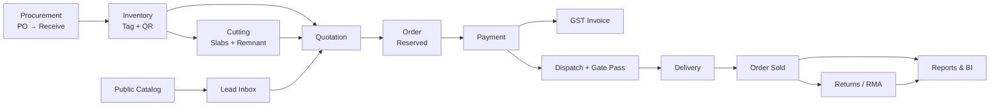
```mermaid
flowchart LR
  PO[Procurement<br/>PO → Receive] --> INV[Inventory<br/>Tag + QR]
  INV --> CUT[Cutting<br/>Slabs + Remnant]
  INV --> QUO[Quotation]
  CUT --> QUO
  CAT[Public Catalog] --> LEAD[Lead Inbox]
  LEAD --> QUO
  QUO --> ORD[Order<br/>Reserved]
  ORD --> PAY[Payment]
  PAY --> INVc[GST Invoice]
  PAY --> DISP[Dispatch + Gate Pass]
  DISP --> DEL[Delivery]
  DEL --> SOLD[Order Sold]
  SOLD --> RET[Returns / RMA]
  SOLD --> REP[Reports & BI]
  RET --> REP
```

---

## 1. 👤 User Onboarding & Account Setup

ShilaTeq is a **provisioned, not self-service** platform. There is no public "sign up" button; a yard is set up for the owner, who then provisions their own staff from inside the app.

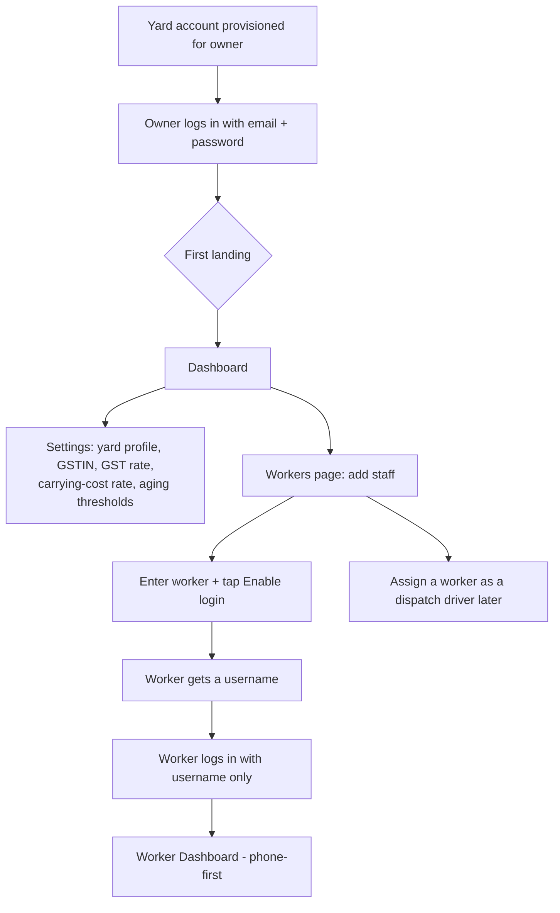
```mermaid
flowchart TD
  A[Yard account provisioned for owner] --> B[Owner logs in with email + password]
  B --> C{First landing}
  C --> D[Dashboard]
  D --> E[Settings: yard profile, GSTIN, GST rate,<br/>carrying-cost rate, aging thresholds]
  D --> F[Workers page: add staff]
  F --> G[Enter worker + tap Enable login]
  G --> H[Worker gets a username]
  H --> I[Worker logs in with username only]
  I --> J[Worker Dashboard - phone-first]
  F --> K[Assign a worker as a dispatch driver later]
```

**Key rules**
- **✅ Owner accounts are provisioned externally**, not self-signed-up. The owner signs in with **email + password** and lands on the [Dashboard](08_Reports_and_Analytics.md).
- **✅ Workers are created by an admin** from the Workers page. When the admin taps *Enable login*, the worker receives a **username** and can thereafter sign in with **username only** (no email, no visible password prompt) — designed for low-literacy, phone-only shop-floor staff.
- **✅ A "driver" is not a separate account.** Any login-enabled worker becomes a driver the moment an admin assigns them to a dispatch; they then see only their own deliveries.
- **✅ Yard configuration lives in Settings:** business profile, GSTIN and default GST rate, carrying-cost rate (default **14%/yr** 💡 illustrative default), and inventory aging thresholds (default amber **90 days** / red **180 days**).
- **✅ A demo-data reset** in Settings wipes operational data while preserving the yard and owner login — useful for onboarding trials.

> **⚠️ Limitation:** There is no owner self-signup and no email-based invitation flow today. New yards and new owners are onboarded through an out-of-band provisioning step.

---

## 2. 📦 Procurement Lifecycle (PO → Receive → Blocks)

Buying stone starts with a **Purchase Order** to a supplier and ends with the yard's inventory growing by one row per block — each already carrying a cost basis.

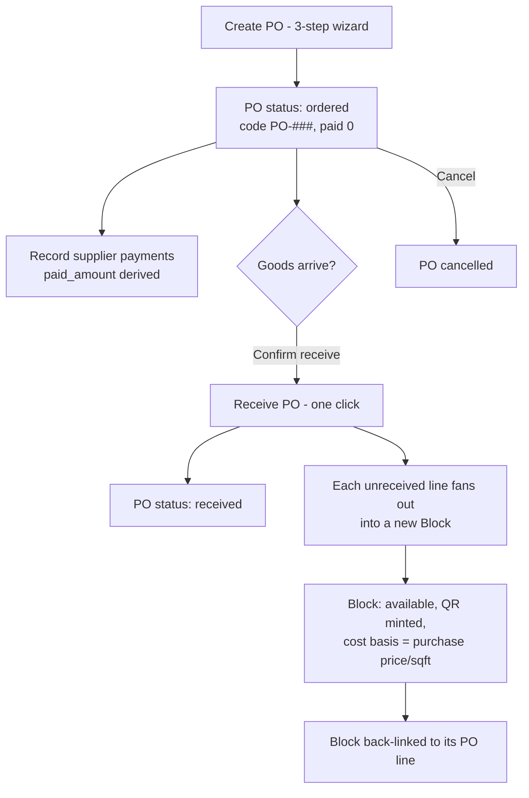
```mermaid
flowchart TD
  A[Create PO - 3-step wizard] --> B[PO status: ordered<br/>code PO-###, paid 0]
  B --> C[Record supplier payments<br/>paid_amount derived]
  B --> D{Goods arrive?}
  D -->|Confirm receive| E[Receive PO - one click]
  E --> F[PO status: received]
  E --> G[Each unreceived line fans out<br/>into a new Block]
  G --> H[Block: available, QR minted,<br/>cost basis = purchase price/sqft]
  H --> I[Block back-linked to its PO line]
  B -->|Cancel| J[PO cancelled]
```

**Key rules**
- **✅ A PO is created via a 3-step wizard** with supplier and line details; it opens in status **`ordered`** with a sequential code `PO-###` and `paid_amount = 0`.
- **✅ Receiving is atomic and one-click.** Confirming receipt flips the PO to **`received`** and, in the same operation, **fans each unreceived line out into a new inventory block** — sized, typed, and stamped with a **QR code** and a **cost basis** (the purchase price per sq ft). Each new block back-links to the PO line it came from.
- **✅ Received blocks arrive as `available`** stock, immediately quotable and sellable.
- **✅ Supplier payments** are recorded against the PO; the PO's `paid_amount` is **derived** from confirmed supplier payments (never typed directly), mirroring the customer-side payment model.
- **💡 A PO can be cancelled** before receipt; cancelled POs never spawn blocks.

---

## 3. 🏷️ Inventory Tagging & QR Minting

Every block gets a permanent **digital identity** — a QR code — the moment it enters the yard, whether it arrived via a PO or was tagged by hand at the gate.

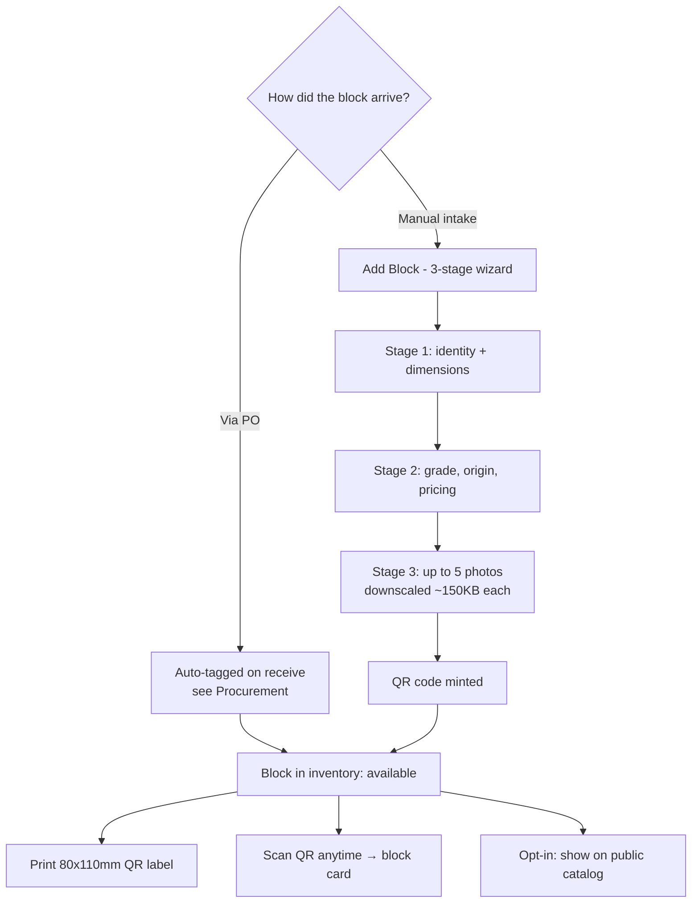
```mermaid
flowchart TD
  A{How did the block arrive?} -->|Via PO| B[Auto-tagged on receive<br/>see Procurement]
  A -->|Manual intake| C[Add Block - 3-stage wizard]
  C --> D[Stage 1: identity + dimensions]
  D --> E[Stage 2: grade, origin, pricing]
  E --> F[Stage 3: up to 5 photos<br/>downscaled ~150KB each]
  F --> G[QR code minted]
  B --> H[Block in inventory: available]
  G --> H
  H --> I[Print 80x110mm QR label]
  H --> J[Scan QR anytime → block card]
  H --> K[Opt-in: show on public catalog]
```

**Key rules**
- **✅ Two intake paths, one identity system.** Blocks created by receiving a PO are auto-tagged; blocks tagged by hand use the **3-stage Add Block wizard** (identity → grade/pricing → photos). Both end with a minted QR code.
- **✅ 12 required fields** to tag a block. **Selling price is required for admins but optional for workers** — workers tag physical stock; pricing is the owner's job.
- **✅ Photos are downscaled** to roughly 150 KB each (up to 5), keeping the catalog and lists fast.
- **✅ The QR code is the block's lifelong handle.** It can be printed as an 80×110 mm label, scanned by phone camera, and resolves to a public, price-safe **block identity card** at `/qr/…`.
- **✅ Catalog opt-in is per block.** A block only appears in the public showroom if it is `available` and the yard chooses to show it; its price is shown publicly only if `show_price_publicly` is on (otherwise "On request").

---

## 4. 🪚 Cutting / Manufacturing (Partial-Cut Engine)

The manufacturing heart of ShilaTeq. A worker feeds a block into the gangsaw, records how much stone was consumed and what slabs came out, and the platform computes **recovery %, wastage, remnant, and recovery-adjusted slab cost** — all from a phone, offline if needed.

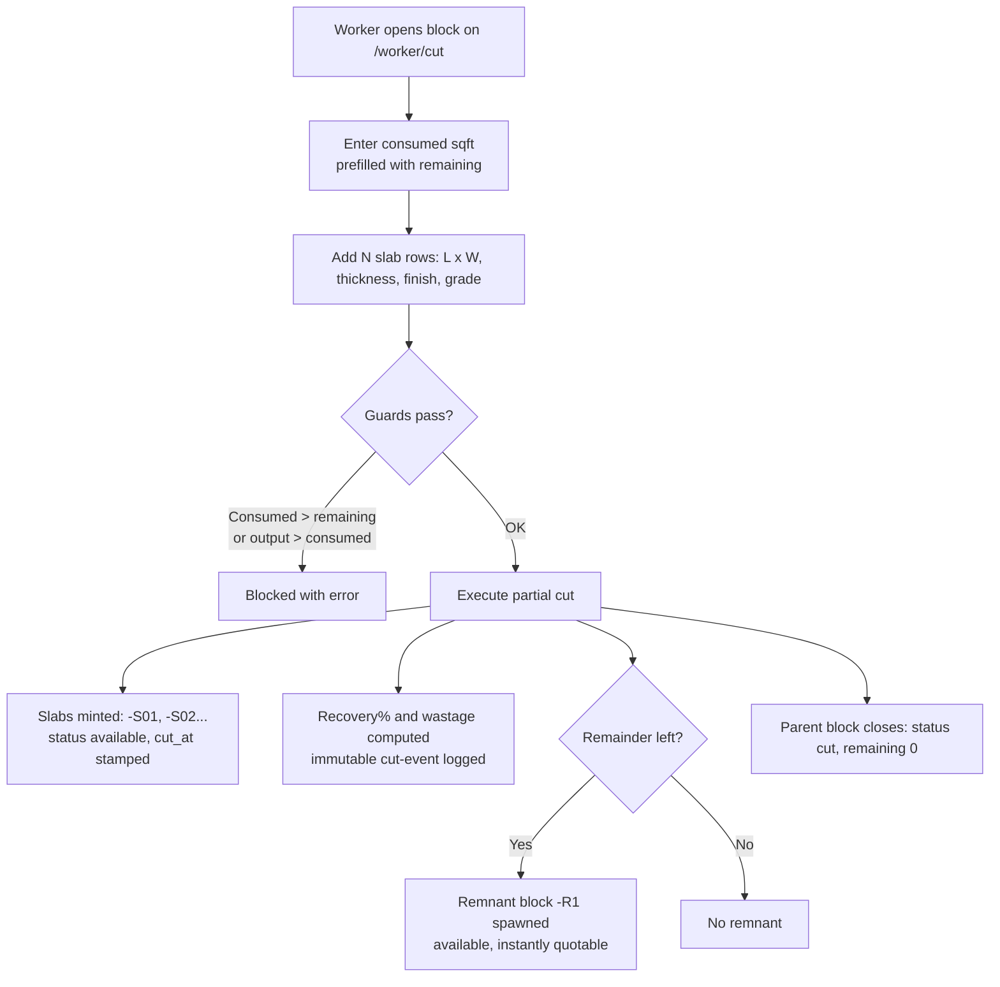
```mermaid
flowchart TD
  A[Worker opens block on /worker/cut] --> B[Enter consumed sqft<br/>prefilled with remaining]
  B --> C[Add N slab rows: L x W, thickness, finish, grade]
  C --> D{Guards pass?}
  D -->|Consumed > remaining<br/>or output > consumed| E[Blocked with error]
  D -->|OK| F[Execute partial cut]
  F --> G[Slabs minted: -S01, -S02...<br/>status available, cut_at stamped]
  F --> H[Recovery% and wastage computed<br/>immutable cut-event logged]
  F --> I{Remainder left?}
  I -->|Yes| J[Remnant block -R1 spawned<br/>available, instantly quotable]
  I -->|No| K[No remnant]
  F --> L[Parent block closes: status cut, remaining 0]
```

**The math (✅ Confirmed)**

| Quantity | How it's derived |
|---|---|
| **Output area** | Sum of each slab's L × W |
| **Wastage** | Consumed area − output area |
| **Recovery %** | Output ÷ consumed × 100 |
| **Slab material cost / sq ft** | Block purchase price × consumed ÷ output — **wastage raises the surviving slabs' unit cost** |
| **Remainder** | Block remaining − consumed |

**Key rules**
- **✅ Wastage is priced in.** Because a block's whole material cost is spread over the *actual* slab output, cutting loss automatically raises the per-sq-ft cost of the slabs that survive — the yard sees true, recovery-adjusted economics, never a rosy nominal cost.
- **✅ The parent block always closes** to status **`cut`** (terminal) with zero remaining. The leftover stone *is* the remnant.
- **✅ A remnant becomes a brand-new `available` block** (`-R1`, `-R2`, …) that inherits the parent's variety/origin/pricing and is **instantly quotable** — nothing is stranded.
- **✅ Every cut writes an immutable cut-event** ledger row (recovery %, wastage) — a permanent audit trail of yield.
- **✅ Cutting is idempotent and offline-safe.** A double-tap or an offline replay of the same cut can never cut a block twice.
- **💡 Admins retain a simpler legacy "full cut"** from the block detail screen (no consumed input, no remnant) for quick conversions.

See [Business Logic](11_Business_Logic.md) for the exact formulas and null-safety rules.

---

## 5. 📄 Quotation Lifecycle

A quotation is a **price proposal that holds no stock**. The same available block can appear on many drafts at once — quotes compete for stock, they don't lock it.

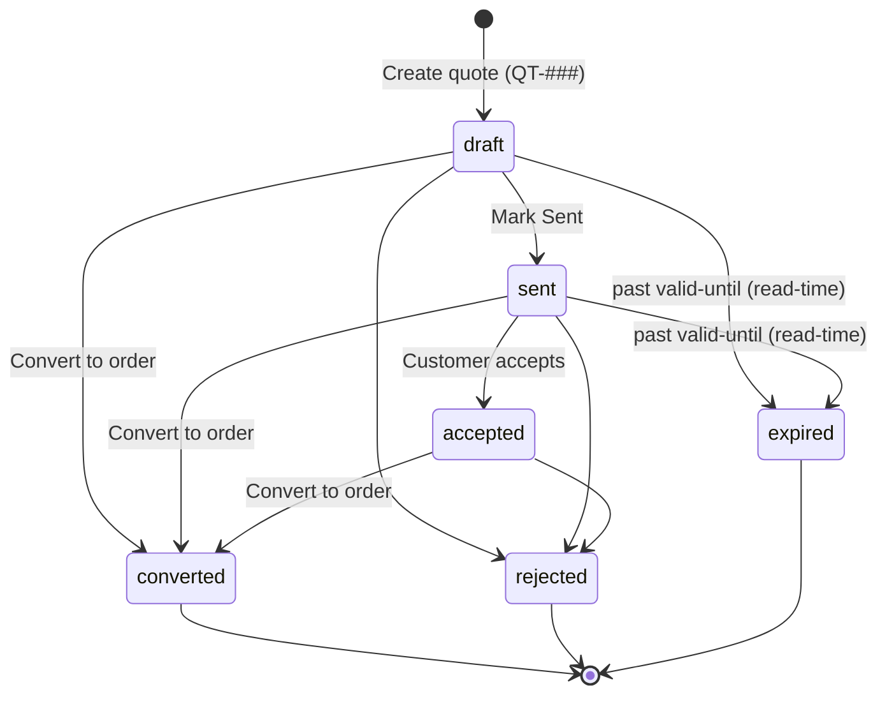
```mermaid
stateDiagram-v2
  [*] --> draft: Create quote (QT-###)
  draft --> sent: Mark Sent
  sent --> accepted: Customer accepts
  draft --> converted: Convert to order
  sent --> converted: Convert to order
  accepted --> converted: Convert to order
  draft --> rejected
  sent --> rejected
  accepted --> rejected
  draft --> expired: past valid-until (read-time)
  sent --> expired: past valid-until (read-time)
  converted --> [*]
  rejected --> [*]
  expired --> [*]
```

**Key rules**
- **✅ Quotes don't hold stock — by design.** Nothing is reserved until conversion, so a single block may be quoted on many drafts simultaneously.
- **✅ Expiry is computed at read time** from the quote's *valid-until* date and lazily persisted — a quote past its date reads as **`expired`** without a nightly job.
- **✅ Conversion is race-guarded.** Converting re-checks that every line is still `available` (both in the UI and on the server); if any block was reserved or sold in the meantime, conversion is refused.
- **✅ On successful conversion**, an order is created in status **`reserved`**, each block/slab flips to **`reserved`**, and the quotation is marked **`converted`** with a back-link to the order.
- **✅ Customer-facing send** uses a WhatsApp quotation template (see [Notifications](09_Notifications.md)); the printed quotation carries a catalog QR footer.

---

## 6. 🛒 Order Lifecycle & Reservation (Payment-Gated)

An order is the commercial spine of the platform. It moves through a strict, **payment-gated pipeline** and holds real stock from the moment it is created.

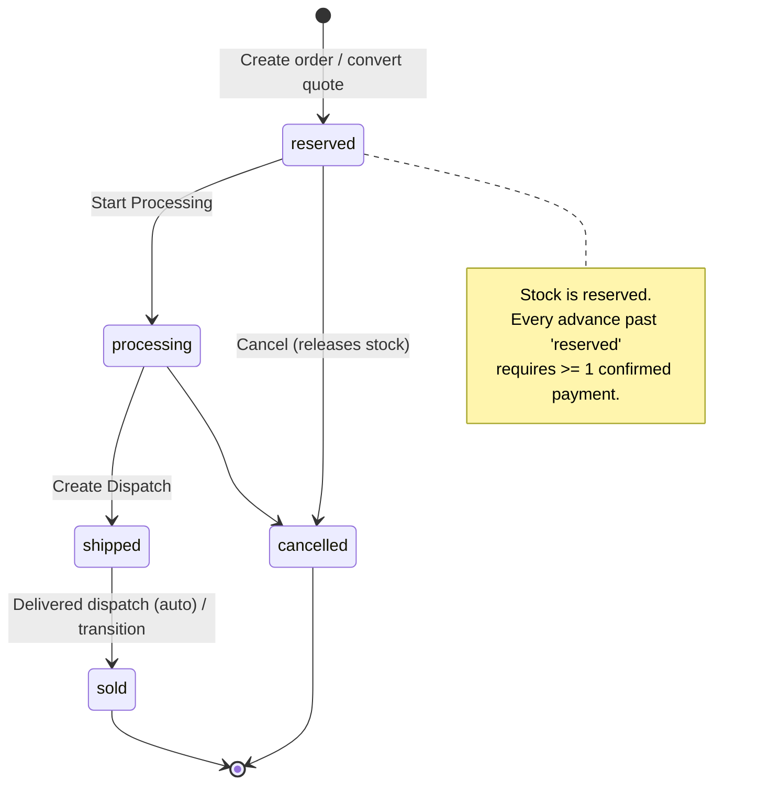
```mermaid
stateDiagram-v2
  [*] --> reserved: Create order / convert quote
  reserved --> processing: Start Processing
  processing --> shipped: Create Dispatch
  shipped --> sold: Delivered dispatch (auto) / transition
  reserved --> cancelled: Cancel (releases stock)
  processing --> cancelled
  note right of reserved
    Stock is reserved.
    Every advance past 'reserved'
    requires >= 1 confirmed payment.
  end note
  sold --> [*]
  cancelled --> [*]
```

**Two ways to create an order**

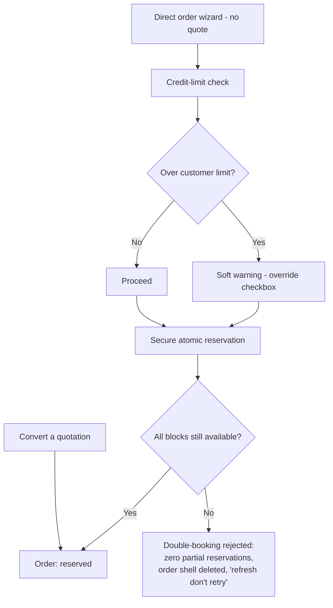
```mermaid
flowchart TD
  A[Convert a quotation] --> R[Order: reserved]
  B[Direct order wizard - no quote] --> C[Credit-limit check]
  C --> D{Over customer limit?}
  D -->|Yes| E[Soft warning - override checkbox]
  D -->|No| F[Proceed]
  E --> G[Secure atomic reservation]
  F --> G
  G --> H{All blocks still available?}
  H -->|No| I[Double-booking rejected:<br/>zero partial reservations,<br/>order shell deleted, 'refresh don't retry']
  H -->|Yes| R
```

**Key rules**
- **✅ Every advance past `reserved` requires at least one confirmed payment.** The platform blocks *Start Processing* and *Create Dispatch* until a confirmed payment exists (see Payment Lifecycle below).
- **✅ Reservation is atomic — all or nothing.** The secure reservation locks every requested block/slab and flips them in a single compare-and-swap. If any one is no longer available, the whole reservation is rolled back (**zero partial reservations**), the order shell is discarded, and the user is told the block is no longer available.
- **✅ Concurrency policy is "refresh, don't retry."** On a double-booking conflict the client refetches fresh state rather than blindly retrying a stale intent — so two salespeople can never sell the same slab.
- **✅ Soft credit-limit gate on direct orders.** If the customer's total exposure (existing unpaid orders + this one) would exceed their credit limit, ShilaTeq warns and requires an explicit **override** to proceed. A null limit means unlimited.
- **✅ Reserved orders are editable.** Lines can be added/removed with automatic re-reserve/release of stock, with a floor at the amount already paid.
- **✅ Cancelling any pre-sold order releases its reserved stock** back to `available`.

---

## 7. 💰 Payment Lifecycle

Payments are what **unlock** the order pipeline. ShilaTeq never lets you type a paid amount directly — it's always **derived from confirmed payments**, so the money and the stock can never drift apart.

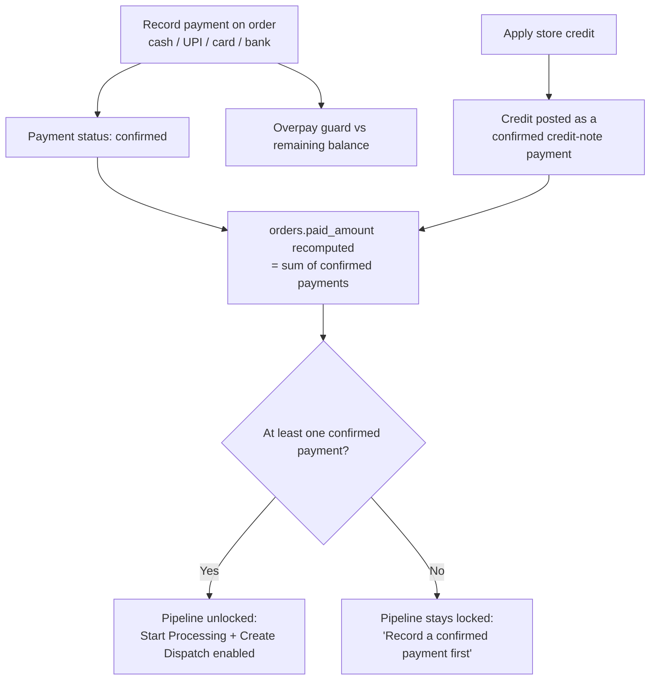
```mermaid
flowchart TD
  A[Record payment on order<br/>cash / UPI / card / bank] --> B[Payment status: confirmed]
  B --> C[orders.paid_amount recomputed<br/>= sum of confirmed payments]
  C --> D{At least one confirmed payment?}
  D -->|Yes| E[Pipeline unlocked:<br/>Start Processing + Create Dispatch enabled]
  D -->|No| F[Pipeline stays locked:<br/>'Record a confirmed payment first']
  A --> G[Overpay guard vs remaining balance]
  H[Apply store credit] --> I[Credit posted as a<br/>confirmed credit-note payment]
  I --> C
```

**Key rules**
- **✅ `paid_amount` is always derived**, never written by hand — it equals the sum of that order's *confirmed* payments. The supplier side works identically for POs.
- **✅ One confirmed payment unlocks the pipeline.** Until it exists, the order cannot leave `reserved`.
- **✅ Overpayment is capped** both in the UI (against remaining balance) and on the server (confirmed payments cannot exceed the order total from surviving lines).
- **✅ Store credit spends like cash.** Applying a customer's store credit posts a confirmed **credit-note** payment, so it folds into `paid_amount` exactly like a cash receipt — and is capped to the lesser of available credit and outstanding balance.
- **✅ Payment modes:** cash, UPI, card, bank transfer, plus the system-generated credit-note. **💡 No online payment gateway** — receipts are recorded manually.
- **✅ The Sold cascade** (triggered on delivery or explicit completion) freezes a **COGS snapshot** onto each order line, so later price edits never rewrite historical margin.

---

## 8. 🧾 Invoicing (GST Invoice Generation)

One order, one tax invoice. ShilaTeq generates an **India-compliant GST invoice** with the correct CGST/SGST/IGST split, HSN code, and amount in words.

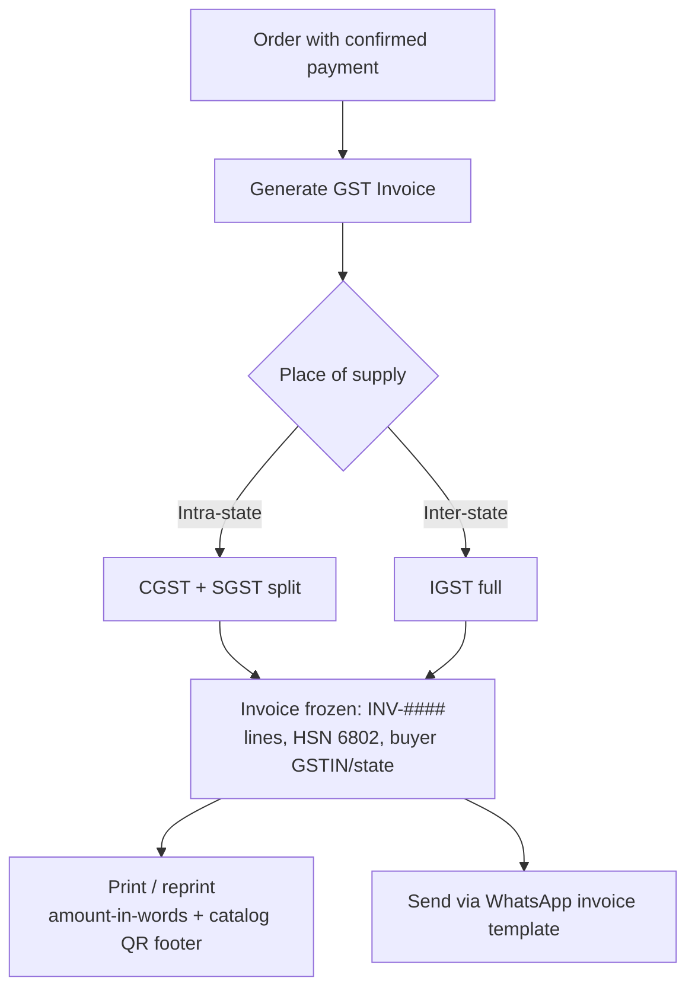
```mermaid
flowchart TD
  A[Order with confirmed payment] --> B[Generate GST Invoice]
  B --> C{Place of supply}
  C -->|Intra-state| D[CGST + SGST split]
  C -->|Inter-state| E[IGST full]
  D --> F[Invoice frozen: INV-####<br/>lines, HSN 6802, buyer GSTIN/state]
  E --> F
  F --> G[Print / reprint<br/>amount-in-words + catalog QR footer]
  F --> H[Send via WhatsApp invoice template]
```

**Key rules**
- **✅ One invoice per order** (enforced) — with a sequential `INV-####` number minted automatically.
- **✅ GST split is exact.** For an intra-state sale the tax is split into CGST and SGST (a remainder trick keeps the halves adding up to the penny); for an inter-state sale it's a single IGST line. Place-of-supply is a manual toggle at generation time.
- **✅ Worked-stone HSN is 6802** across invoices.
- **✅ The invoice is a frozen snapshot** — line items, buyer name/GSTIN/state are captured at generation; the seller block is re-rendered live from the yard profile at print time.
- **✅ The printed invoice includes amount-in-words** (Indian crore/lakh/thousand grouping) and a catalog QR footer that turns every invoice into a showroom link.

---

## 9. 🚚 Dispatch, Gate Pass, Driver & Delivery

Dispatch closes the loop: it prints a **gate pass**, hands the order to a **driver**, gives the customer a **public live-tracking link**, and — on delivery — **auto-completes the order to `sold`**.

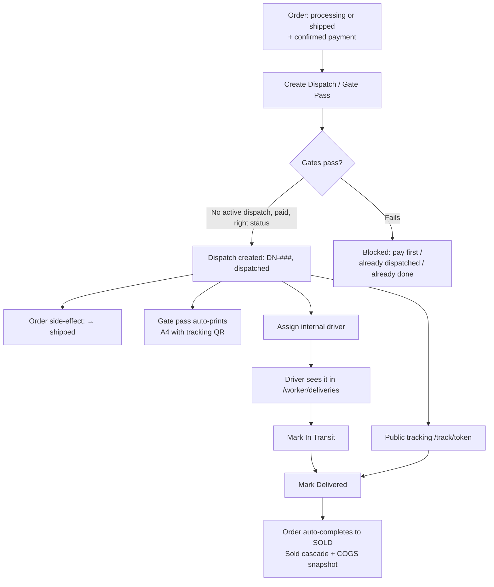
```mermaid
flowchart TD
  A[Order: processing or shipped<br/>+ confirmed payment] --> B[Create Dispatch / Gate Pass]
  B --> C{Gates pass?}
  C -->|No active dispatch, paid, right status| D[Dispatch created: DN-###, dispatched]
  C -->|Fails| X[Blocked: pay first /<br/>already dispatched / already done]
  D --> E[Order side-effect: → shipped]
  D --> F[Gate pass auto-prints<br/>A4 with tracking QR]
  D --> G[Assign internal driver]
  G --> H[Driver sees it in /worker/deliveries]
  H --> I[Mark In Transit]
  I --> J[Mark Delivered]
  D --> K[Public tracking /track/token]
  K --> J
  J --> L[Order auto-completes to SOLD<br/>Sold cascade + COGS snapshot]
```

**Dispatch state machine (✅ Confirmed)**

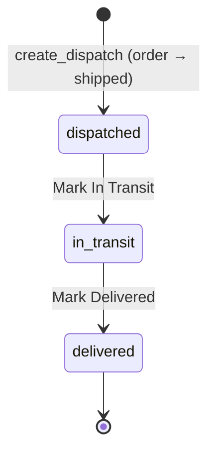
```mermaid
stateDiagram-v2
  [*] --> dispatched: create_dispatch (order → shipped)
  dispatched --> in_transit: Mark In Transit
  in_transit --> delivered: Mark Delivered
  delivered --> [*]
```

**Key rules**
- **✅ Dispatch is SOP-gated.** Creating one requires the order to be `processing`/`shipped`, to have a confirmed payment, and to have no active dispatch already.
- **✅ Creating a dispatch advances the order to `shipped`** as a side effect and mints a `DN-###` gate pass with a random public tracking token.
- **✅ The gate pass auto-prints** as a self-contained A4 "Gate Pass / Loading Slip" with an embedded tracking QR, live seller block, item list, and signature areas — clearly marked "not a tax invoice." It's reprintable anytime.
- **✅ Drivers see only their own deliveries.** An assigned driver's delivery list shows only their dispatches, with forward-only *Mark In Transit → Mark Delivered* buttons, in English or Hindi.
- **✅ Delivery auto-sells the order.** A delivered dispatch triggers the **Sold cascade**: the order becomes `sold`, its blocks/slabs become `sold` with sale price and date, a COGS snapshot is frozen onto each line, and any active worker assignments complete. No manual "mark sold" step is needed.
- **✅ Public tracking needs no login.** Customers open `/track/<token>` to see live delivery stage; the page shows safe fields only (no prices).

> **⚠️ Limitation:** Public token-based tracking works against the live backend; it is not wired into the zero-infrastructure demo mode.

---

## 10. ↩️ Returns / RMA (Restock vs Scrap + Store Credit)

Returns are handled per line, with a clear choice: put good stone **back on the shelf**, or **scrap** damaged stone and book the loss — with any customer overpayment turning into **store credit**.

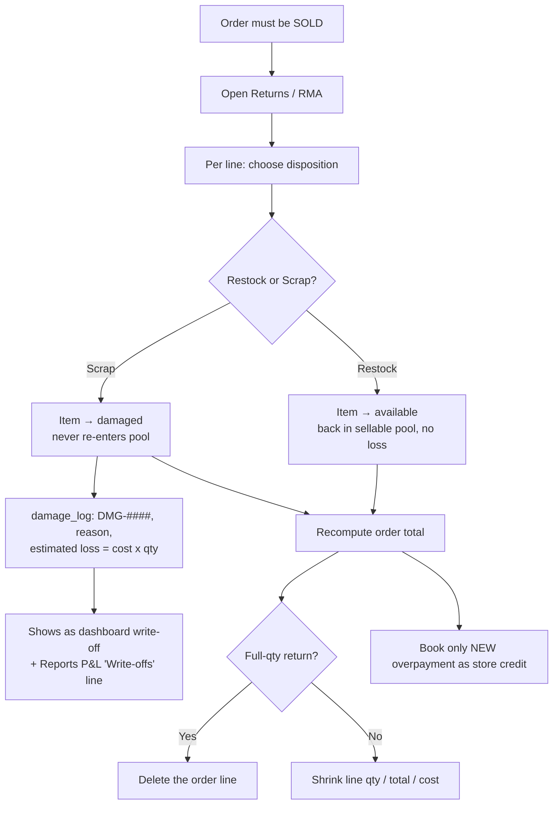
```mermaid
flowchart TD
  A[Order must be SOLD] --> B[Open Returns / RMA]
  B --> C[Per line: choose disposition]
  C --> D{Restock or Scrap?}
  D -->|Restock| E[Item → available<br/>back in sellable pool, no loss]
  D -->|Scrap| F[Item → damaged<br/>never re-enters pool]
  F --> G[damage_log: DMG-####, reason,<br/>estimated loss = cost x qty]
  G --> H[Shows as dashboard write-off<br/>+ Reports P&L 'Write-offs' line]
  E --> I[Recompute order total]
  F --> I
  I --> J{Full-qty return?}
  J -->|Yes| K[Delete the order line]
  J -->|No| L[Shrink line qty / total / cost]
  I --> M[Book only NEW overpayment as store credit]
```

**Key rules**
- **✅ Returns are allowed only on `sold` orders.** Attempting a return on any other status is refused.
- **✅ Restock returns good stone to the `available` pool** with no loss booked. **Scrap marks it `damaged`** — and damaged stone **never re-enters the sellable pool**; it's excluded from every selector, finder, and stock-value snapshot.
- **✅ Every scrap writes a `damage_log` row** (`DMG-####`, a reason, and an estimated loss on a COGS basis) that surfaces as a dashboard write-off alert and a "Write-offs" line in the P&L report.
- **✅ Store credit is booked incrementally.** Only the *new* overpayment a return introduces is credited to the customer's store-credit ledger, so repeated returns on the same order can never double-count credit. The order's paid amount is left untouched — the delta becomes the customer's money.
- **✅ Line accounting is careful.** A full-quantity return deletes the order line entirely (a zeroed line could otherwise be wrongly re-released later); a partial return shrinks the line's quantity, total, and cost.

Store-credit mechanics are covered in [Business Logic](11_Business_Logic.md).

---

## 11. 🌐 Public Catalog → Lead → Reply

The yard's **online 3D showroom** turns anonymous web visitors into qualified leads that land in the admin inbox — and a single WhatsApp reply moves the lead forward automatically.

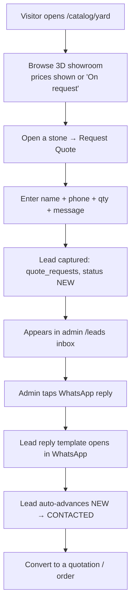
```mermaid
flowchart TD
  A[Visitor opens /catalog/yard] --> B[Browse 3D showroom<br/>prices shown or 'On request']
  B --> C[Open a stone → Request Quote]
  C --> D[Enter name + phone + qty + message]
  D --> E[Lead captured: quote_requests, status NEW]
  E --> F[Appears in admin /leads inbox]
  F --> G[Admin taps WhatsApp reply]
  G --> H[Lead reply template opens in WhatsApp]
  H --> I[Lead auto-advances NEW → CONTACTED]
  I --> J[Convert to a quotation / order]
```

**Lead state (✅ Confirmed)**

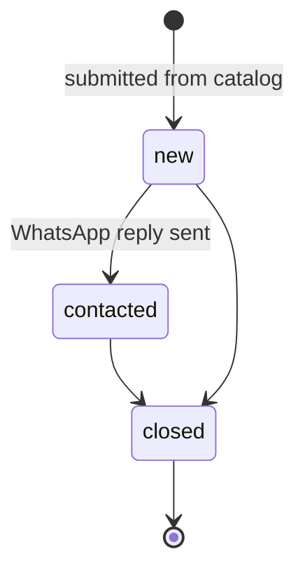
```mermaid
stateDiagram-v2
  [*] --> new: submitted from catalog
  new --> contacted: WhatsApp reply sent
  contacted --> closed
  new --> closed
  closed --> [*]
```

**Key rules**
- **✅ No login, no data leakage.** The public catalog reads only safe, narrow data: available blocks, safe columns, price gated per block ("On request" when hidden), zone-level location only — never purchase price, supplier, or notes.
- **✅ Lead capture is validated and yard-scoped.** A submission needs a name and phone; the referenced block is only attached if it truly belongs to that yard.
- **✅ Leads land as `new`** in the admin inbox (new / contacted / closed).
- **✅ A WhatsApp reply auto-advances the lead** from `new` to `contacted` and pre-fills a friendly reply (with a catalog promo footer) — the reply *is* the status change.

The showroom experience is detailed in [Product Overview](01_Product_Overview.md) and [Screens & Pages](06_Screens_and_Pages.md).

---

## 12. 📊 Reporting Workflow

Reporting in ShilaTeq is a **pure pipeline**: live operational data → computed metrics → plain-language insights → decisions and exports. It's always up to date because it recomputes from source, never from a stale summary table.

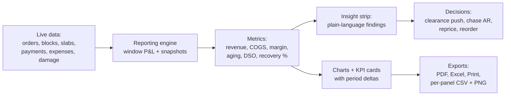
```mermaid
flowchart LR
  A[Live data:<br/>orders, blocks, slabs,<br/>payments, expenses, damage] --> B[Reporting engine<br/>window P&L + snapshots]
  B --> C[Metrics:<br/>revenue, COGS, margin,<br/>aging, DSO, recovery %]
  C --> D[Insight strip:<br/>plain-language findings]
  C --> E[Charts + KPI cards<br/>with period deltas]
  D --> F[Decisions:<br/>clearance push, chase AR,<br/>reprice, reorder]
  E --> G[Exports:<br/>PDF, Excel, Print,<br/>per-panel CSV + PNG]
```

**Key rules**
- **✅ A date range drives the window P&L** (revenue, COGS, gross/net profit) while balance-sheet-style snapshots (stock value, aging, receivables/payables) are always "as of now," never date-filtered.
- **✅ Every KPI carries a period-over-period delta** so the owner sees direction, not just level.
- **✅ Insights are generated in plain language** — up to a handful of findings like "Revenue up 12% vs last period" or "₹X of stock has aged past 180 days — consider a clearance push."
- **✅ Exports are one control:** branded PDF, a genuinely-recomputed weekly deep-dive, multi-sheet Excel, and Print — plus per-panel CSV and chart-as-PNG.

Full detail lives in [Reports & Analytics](08_Reports_and_Analytics.md).

---

## 13. 🔔 Notification & Alert Workflow

ShilaTeq surfaces the things that need a human: **toasts** confirm actions, the **notifications bell** and **dashboard alerts** rank what needs attention, and **WhatsApp** carries messages to customers — all kept live by an event-driven refresh belt.

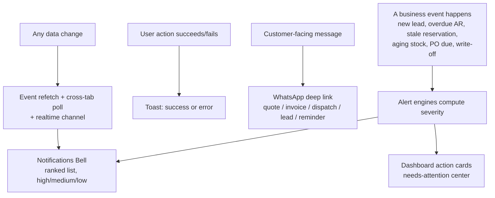
```mermaid
flowchart TD
  A[A business event happens<br/>new lead, overdue AR, stale reservation,<br/>aging stock, PO due, write-off] --> B[Alert engines compute severity]
  B --> C[Notifications Bell<br/>ranked list, high/medium/low]
  B --> D[Dashboard action cards<br/>needs-attention center]
  E[User action succeeds/fails] --> F[Toast: success or error]
  G[Customer-facing message] --> H[WhatsApp deep link<br/>quote / invoice / dispatch / lead / reminder]
  I[Any data change] --> J[Event refetch + cross-tab poll<br/>+ realtime channel] --> C
```

**Key rules**
- **✅ Two independent alert engines.** The header **notifications bell** ranks leads, aging stock, receivables, PO/AP due, and stale reservations; the **dashboard** runs its own action-card engine (overdue AR, ready-to-dispatch, unmarked attendance, wages/supplier payable, write-offs).
- **✅ Toasts confirm every action** — a green success or a red error — so users always know a save landed.
- **✅ WhatsApp is the messaging layer** — five zero-API deep-link templates (quote, invoice, dispatch+tracking, lead reply, payment reminder).
- **✅ Everything stays live** via an event-driven refetch, a cross-tab poll, and a realtime channel — no manual reload needed.

Every mechanism is documented in full in [Notifications](09_Notifications.md).

---

## Appendix — All State Machines at a Glance

The definitive lifecycle of each core entity. These are **server-enforced** — the platform refuses any transition not shown here.

### Block

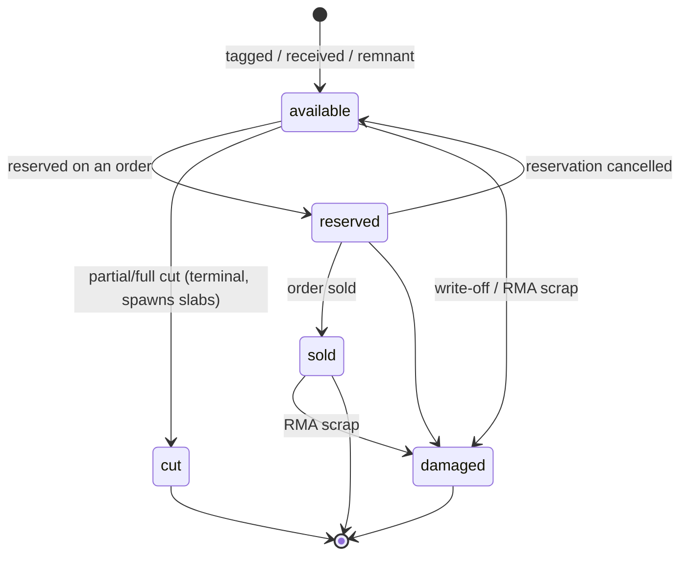
```mermaid
stateDiagram-v2
  [*] --> available: tagged / received / remnant
  available --> reserved: reserved on an order
  reserved --> available: reservation cancelled
  reserved --> sold: order sold
  available --> cut: partial/full cut (terminal, spawns slabs)
  available --> damaged: write-off / RMA scrap
  reserved --> damaged
  sold --> damaged: RMA scrap
  sold --> [*]
  cut --> [*]
  damaged --> [*]
```

### Slab

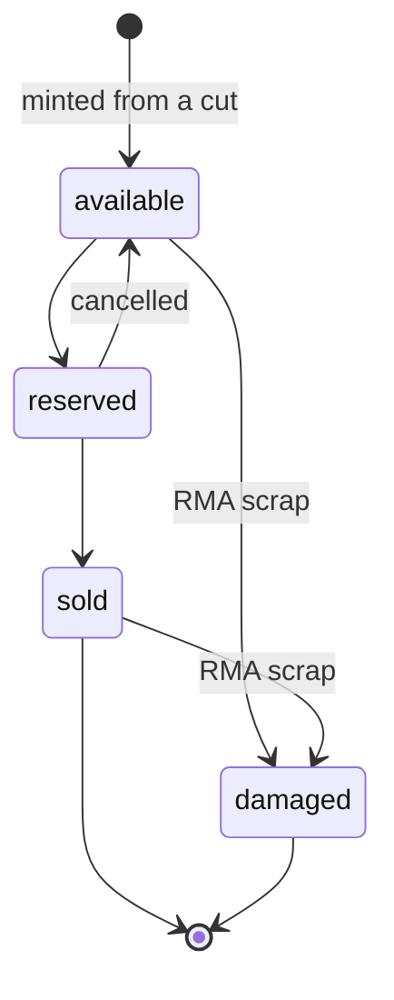
```mermaid
stateDiagram-v2
  [*] --> available: minted from a cut
  available --> reserved
  reserved --> available: cancelled
  reserved --> sold
  available --> damaged: RMA scrap
  sold --> damaged: RMA scrap
  sold --> [*]
  damaged --> [*]
```

### Purchase Order

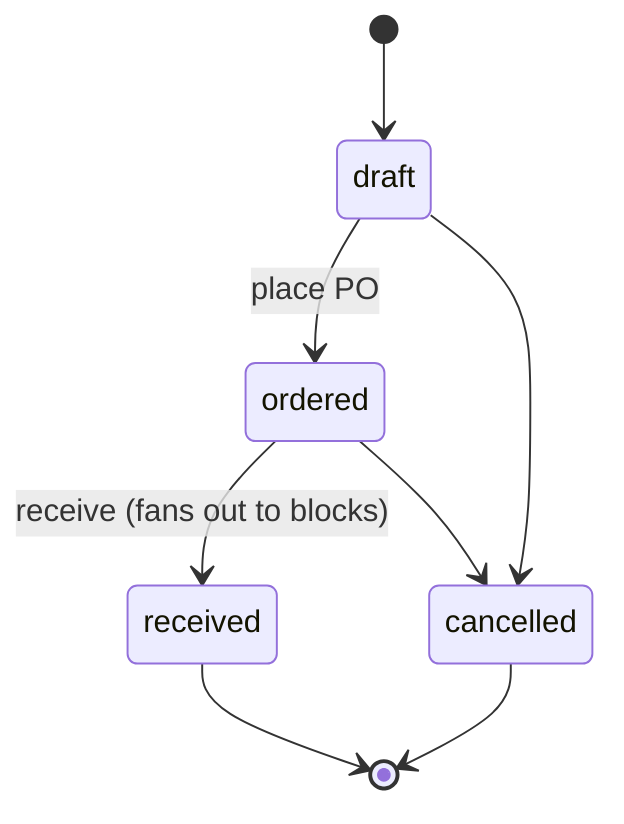
```mermaid
stateDiagram-v2
  [*] --> draft
  draft --> ordered: place PO
  ordered --> received: receive (fans out to blocks)
  draft --> cancelled
  ordered --> cancelled
  received --> [*]
  cancelled --> [*]
```

### Quotation

```mermaid
stateDiagram-v2
  [*] --> draft
  draft --> sent
  sent --> accepted
  draft --> converted
  sent --> converted
  accepted --> converted
  draft --> rejected
  sent --> rejected
  accepted --> rejected
  draft --> expired: read-time
  sent --> expired: read-time
  converted --> [*]
  rejected --> [*]
  expired --> [*]
```

### Order

```mermaid
stateDiagram-v2
  [*] --> reserved
  reserved --> processing: needs a confirmed payment
  processing --> shipped: via Create Dispatch
  shipped --> sold: via delivered dispatch / transition
  reserved --> cancelled
  processing --> cancelled
  sold --> [*]
  cancelled --> [*]
```

### Dispatch

```mermaid
stateDiagram-v2
  [*] --> dispatched
  dispatched --> in_transit
  in_transit --> delivered
  delivered --> [*]
```

> **💡 Tip:** The single rule that ties all of these together — *every order advance past `reserved` needs at least one confirmed payment, and a delivered dispatch auto-sells the order* — is what makes ShilaTeq's pipeline safe to run without a back-office reconciliation team.

---

*Part of the **ShilaTeq (StoneX) Product Documentation Hub**. See also: [User Journeys](05_User_Journeys.md) · [Reports & Analytics](08_Reports_and_Analytics.md) · [Notifications](09_Notifications.md) · [Business Logic](11_Business_Logic.md).*
