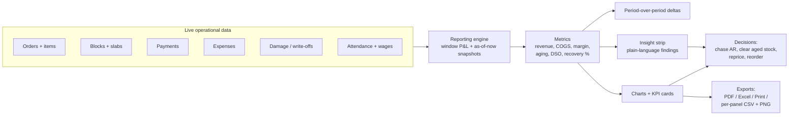
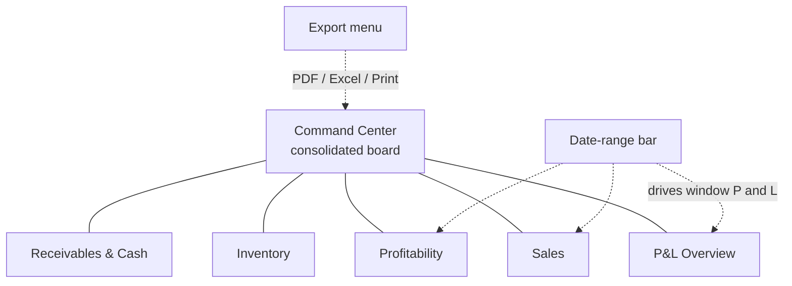

# 📊 Reports & Analytics

> The business intelligence layer of ShilaTeq (StoneX) — the Dashboard action center, a five-tab analytics suite, per-block lifetime P&L, plain-language insights, and one-tap exports.

[← Back to Documentation Hub](README.md)

---

## About this document

A stone yard's numbers usually live in a paper register, a WhatsApp thread, and the owner's head. ShilaTeq replaces all three with a **single source of truth** and turns it into decisions. This page documents the platform's reporting and BI surface:

- The **Dashboard** — the daily home screen: headline KPIs, a needs-attention action center, and at-a-glance operational cards.
- The **Reports & Analytics** suite — a tabbed BI workspace covering P&L, Sales, Inventory, Profitability, and Receivables & Cash, with a consolidated Command Center board on top.
- **Inventory Analytics** — per-block lifetime profit-and-loss and aging.
- The **metric catalog**, the **insight strip**, and every **export** format.

Everything here recomputes from **live operational data** — orders, blocks, slabs, payments, expenses, write-offs — so there is no stale summary table to refresh. A recurring design rule governs every number: **an unknown cost surfaces as "N/A", never as zero** — the reports never fabricate a 100% margin.

**Related reading:** [Business Workflows](07_Business_Workflows.md) · [Business Logic](11_Business_Logic.md) · [Notifications](09_Notifications.md) · [Modules](03_Modules.md)

---

## From data to decision

The whole reporting stack is one pure pipeline. Live records flow through a computation engine into metrics, metrics become plain-language insights, and insights drive action — with exports at every stop.

---

## 🏠 The Dashboard — the daily home screen

The Dashboard is where an owner or manager starts every day. It answers three questions immediately: *how much money is in play, what needs my attention, and how is the yard doing right now?*

### Headline KPIs

| KPI | What it shows |
|---|---|
| **To Collect (AR)** | Total open receivables across non-cancelled orders |
| **To Pay (AP)** | Supplier payables + wages payable |
| **Stock Value** | Sellable inventory valued at selling price |
| **Sales (this month)** | Revenue booked in the current month |

Each KPI is tappable and deep-links to the relevant workspace (e.g. *To Collect* → Finance receivables).

### The needs-attention action center

The heart of the Dashboard is a **severity-ranked list of action cards** — the yard's to-do list, generated automatically from live data. Each card states the situation, the money at stake, and links straight to where you fix it. **✅ Confirmed** alerts include:

| Action card | Trigger | Severity |
|---|---|---|
| **Payments overdue** | Receivables older than 30 days | 🔴 High |
| **Collect outstanding** | Any open AR (when nothing is 30+ days overdue) | 🟠 Medium |
| **Orders ready to dispatch** | Processing/shipped orders with no delivery yet | 🟠 Medium |
| **In-transit deliveries** | Dispatches currently on the road | 🟢 Low |
| **Stock aged past red threshold** | Blocks older than the red aging threshold | 🔴 High |
| **Stock aging (amber)** | Blocks in the amber aging band | 🟠 Medium |
| **Items written off** | Damaged/scrapped stock from returns | 🟠 Medium |
| **Attendance pending** | Active workers not yet marked today | 🟠 Medium |
| **Wages payable** | Net wages owed to workers | 🟢 Low |
| **Payable to suppliers** | Open supplier bills | 🟢 Low |
| **Purchase orders to receive** | POs awaiting goods receipt | 🟢 Low |

When nothing needs action, the center shows a clean **"All clear"** state. Cards are sorted high → medium → low so the most urgent money and operations sit at the top.

> **Note:** The Dashboard runs its **own** alert engine, independent of the header notifications bell. The two overlap deliberately — the bell is the always-visible ambient signal, the Dashboard is the deep, money-quantified action list. Both are covered in [Notifications](09_Notifications.md).

### At-a-glance operational cards

Below the action center, glance cards summarize live operations — **Orders** (reserved, processing, ready to dispatch), **Deliveries** (pending, in transit, delivered today) — and a **Quick Actions** strip (New Order, New Quote, Finance, Attendance, Find Stone) for one-tap navigation to the most common tasks.

---

## 📈 The Reports & Analytics suite

The `/reports` workspace is a **tabbed BI studio**. A big, always-visible tab bar switches between a consolidated Command Center and five focused analytical tabs. A **date-range bar** (with presets and custom ranges) drives every window-based number, and a single **Export** control in the header handles all output.

### Command Center — the consolidated board

The default landing tab is a single-screen executive board that stitches the headline numbers, key charts, and the insight strip into one view — the "everything at once" answer for an owner who wants the pulse of the business without tab-hopping.

### The five analytical tabs

| Tab | Focus | Signature content |
|---|---|---|
| **📑 P&L Overview** | Profit & loss for the selected window | Revenue → COGS → gross profit → expenses → write-offs → **net profit** statement, alongside a trend chart |
| **📈 Sales** | Revenue performance | Revenue over time, breakdowns by stone variety / type / customer, order count, average order value |
| **📦 Inventory** | Stock as it stands now | Stock value, value by variety, **aging bands**, slow-moving stock |
| **💎 Profitability** | Margin quality | Margin and margin % by variety and by order; best/worst performers (unknown-cost lines shown as "n/a") |
| **💰 Receivables & Cash** | Money owed and owing | AR by customer, AP by supplier, open-invoice counts, cash position |

> **💡 Tip:** Window-based tabs (P&L, Sales) respond to the date range; balance-sheet-style tabs (Inventory, Receivables & Cash) are always "as of now" — a receivables snapshot is meaningless if filtered to last March.

### The insight strip

Above the classic tabs sits a **plain-language insight strip** — a handful of one-sentence findings the engine generates from the same numbers, colour-toned good / neutral / warn. **✅ Confirmed** examples:

- *"Revenue up 12% vs the previous period (₹8.4L vs ₹7.5L)."*
- *"Gross margin improved 3 pts to 34%."*
- *"Top seller: Makrana White (₹2.1L, 41% margin)."*
- *"₹1.8L of stock has aged past 180 days — consider a clearance push."*
- *"Gangsaw recovery is averaging 68% slab yield per cut block."*

This is the difference between a chart and an *answer* — the strip tells a non-analyst owner what the numbers *mean* and what to do.

---

## 🧮 The KPI & metric catalog

Every metric ShilaTeq computes, grouped by theme. All are **✅ Confirmed** from the reporting engine unless tagged.

### Profitability & P&L

| Metric | Definition |
|---|---|
| **Revenue** | Sum of sold order-line totals in the window |
| **COGS** | Sum of resolved line costs — **snapshot cost first** (frozen at sale), else live cost |
| **Gross Profit** | Revenue − COGS |
| **Gross Margin %** | Gross profit ÷ revenue |
| **Expenses** | Cashbook expenses in the window |
| **Write-offs** | Estimated loss from scrapped/damaged stock in the window |
| **Net Profit** | Gross profit − expenses − write-offs |
| **Average Order Value (AOV)** | Revenue ÷ order count |
| **Margin / Margin %** | Per variety and per order (**null-safe** — unknown cost → "n/a", never a fake 100%) |

### Inventory & operations

| Metric | Definition |
|---|---|
| **Stock Value** | Available blocks valued at selling price |
| **Slab Value** | Available slab inventory value |
| **Aging Buckets** | Stock value split into fresh / amber / red bands by tag age (yard-configurable thresholds) |
| **Sell-through %** | Sold blocks ÷ total blocks |
| **Gangsaw Recovery %** | Slab output ÷ block input per cut, averaged across cut blocks |
| **Slow-moving stock** | Blocks sitting longest without selling |
| **Carrying Cost** | Annualised holding cost of stock at the yard's carrying rate (report-only; never in COGS) |

### Money & receivables

| Metric | Definition |
|---|---|
| **Receivables (AR)** | Outstanding balance across non-cancelled orders |
| **AR by Customer** | Top open balances by customer |
| **Payables (AP)** | Outstanding balance across supplier POs |
| **DSO (Days Sales Outstanding)** | Receivables ÷ average daily revenue over the window |
| **Wages Payable** | Net wages owed to workers |

### Trend & comparison

Every window KPI also carries a **period-over-period delta** (absolute and %): revenue, gross profit, net profit, AOV, and gross-margin points — so the reader sees direction, not just level. KPI cards render a **mini-sparkline** trend that rasterises cleanly into exported PDFs.

---

## 📉 Charts & visualizations

ShilaTeq's charts share one warm-stone visual system, so every panel reads as part of the same report.

| Visual | Where it's used |
|---|---|
| **Bar charts** | Revenue by variety/customer, receivables by customer, stock by variety |
| **Line / area charts** | Revenue and profit trends over time |
| **Mini-sparklines** | Inline trend on KPI cards (no axes — prints crisply) |
| **P&L statement table** | Revenue → net profit, with profit lines highlighted green and losses red |
| **Drill-in tables** | Rows that click through to the underlying order, block, or customer |
| **Aging bands** | Fresh / amber / red stock-value split |

> **Note:** Charts are rendered as vector SVG, which is why any panel can be exported as a pixel-crisp PNG and why the whole page prints cleanly.

---

## 📦 Inventory Analytics — per-block lifetime P&L

Separate from the reports suite, the **Inventory Analytics** view answers a question every stone trader asks: *did this specific block make money?* For each block it computes a **lifetime profit-and-loss** — purchase cost, processing, revenue from the slabs and remnants it produced, and the resulting margin — plus **aging buckets** showing how long capital has been tied up in stock.

This is where the recovery-adjusted costing pays off: because cutting wastage raises the surviving slabs' unit cost, a block's true economics (not its nominal ones) show up in its lifetime P&L. See [Business Logic](11_Business_Logic.md) for the costing rules.

---

## 📤 Exports

Reports leave ShilaTeq in whatever form the reader needs — one export control drives them all, plus per-panel micro-exports.

| Export | Scope | Format |
|---|---|---|
| **PDF report** | The whole reports page, live charts included | Branded PDF |
| **Weekly deep-dive** | Last 7 days, recomputed through the same engine | Branded PDF |
| **Excel workbook** | All report data | Multi-sheet `.xlsx` |
| **Print** | The whole page | Browser print (print-optimised layout) |
| **Panel CSV** | A single section's underlying rows | CSV (Excel-safe: formula-injection neutralised, UTF-8 BOM so ₹ survives) |
| **Chart PNG** | A single chart | PNG image |

> **✅ Confirmed:** The weekly deep-dive is *genuinely recomputed* over the last seven days through the same engine — it is not a re-crop of the current view. **💡** Heavy export libraries are loaded only when an export is triggered, keeping the app fast for everyday use.

**Beyond reports, the platform also prints operational documents** (documented in [Business Workflows](07_Business_Workflows.md)): GST invoices, quotations, dispatch gate passes with tracking QR, and 80×110 mm block QR labels.

---

## 🎯 Decision-making benefits

The point of all this is not dashboards for their own sake — it's better decisions, faster.

| The yard can now… | Because ShilaTeq surfaces… |
|---|---|
| **Chase the right money first** | Receivables ranked by customer and age; overdue-AR alerts with rupee amounts |
| **Clear dead stock before it costs more** | Aging bands, slow-moving list, carrying cost, and a plain-language "consider a clearance push" nudge |
| **Price with confidence** | True, recovery-adjusted margins per variety and per block — never a fabricated margin |
| **Cut better** | Gangsaw recovery % per block, so low-yield operators or blocks stand out |
| **Know real profit** | A full P&L that nets out COGS, expenses, and write-offs — not just top-line sales |
| **Manage cash** | AR/AP snapshots, DSO, and wages payable in one place |
| **Act, not just look** | The Dashboard action center converts every metric into a linked to-do |

---

## Honest limitations

> **⚠️ Limitation:** ShilaTeq's analytics are **operational BI**, not a data-warehouse or ad-hoc query tool. There is no custom report builder, no scheduled email delivery of reports (exports are manual — the platform has no email channel at all), and no cross-yard consolidated rollup for multi-yard groups. Carrying cost uses a simple annualised model and is deliberately kept out of COGS. For most single-yard operators, the built-in suite covers the daily and monthly questions end to end.

---

*Part of the **ShilaTeq (StoneX) Product Documentation Hub**. See also: [Business Workflows](07_Business_Workflows.md) · [Business Logic](11_Business_Logic.md) · [Notifications](09_Notifications.md) · [Modules](03_Modules.md).*
