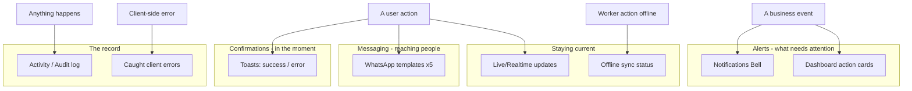

# 🔔 Notifications, Alerts & Messaging

> Every way ShilaTeq (StoneX) tells someone something — toasts, the alerts bell, dashboard action cards, WhatsApp templates, live sync status, offline sync status, and the activity log.

[← Back to Documentation Hub](README.md)

---

## About this document

A yard runs on timely nudges: *a new lead just came in, this payment is overdue, that block has been sitting for six months, your progress saved even though the Wi-Fi dropped.* ShilaTeq turns those moments into clear, well-placed signals. This page documents **every notification and communication mechanism** in the platform, and for each one answers four questions:

- **What it is** — the mechanism.
- **When it's triggered** — the event behind it.
- **Why it's useful** — the business value.
- **Who sees it** — the audience.

We also flag the honest gaps: **there is no email channel**, and **server-side audit logging is only partially wired**. These are marked clearly below.

**Related reading:** [Business Workflows](07_Business_Workflows.md) · [Reports & Analytics](08_Reports_and_Analytics.md) · [Integrations](10_Integrations.md) · [User Roles](04_User_Roles.md)

---

## The notification landscape

ShilaTeq's signals fall into three layers: **confirmations** (did my action work?), **alerts** (what needs my attention?), and **messages** (reaching the customer or driver). A live-sync belt keeps every screen current, and an activity log records what happened.

---

## 1. ✅ In-app toasts (action confirmations)

**What it is.** Small, transient banners that pop in after an action — green for success, red for failure — then fade on their own. They are the platform's constant "yes, that worked" / "no, here's why" feedback.

**When it's triggered.** After virtually every user action: saving a block, recording a payment, converting a quote, marking a delivery, applying store credit, running an export. Failures raise an error toast with the reason (e.g. *"Block no longer available."*, *"Record a confirmed payment first."*, *"Export failed — try again."*).

**Why it's useful.** No user is ever left wondering whether a tap landed. On a busy shop floor or a spotty connection, immediate confirmation prevents double-submits and lost work.

**Who sees it.** Everyone — admins and workers, on the exact screen where they acted.

> **💡 Tip:** Toasts pair with the optimistic UI: a worker's action shows instantly, and the toast confirms once it syncs — even if that sync happens minutes later after the connection returns.

---

## 2. 🔔 The Notifications Bell (alerts engine)

**What it is.** A bell in the app header that opens a **severity-ranked list of alerts** — the always-visible ambient pulse of the business. Alerts are sorted **high → medium → low** so the most urgent items sit on top, each linking straight to where it's handled.

**When it's triggered.** The engine recomputes from live data and surfaces:

| Alert | Trigger | Severity | Links to |
|---|---|---|---|
| **New leads from your catalogue** | Unactioned public-catalog enquiries | 🔴 High | Leads inbox |
| **Stock aged past red threshold** | Blocks older than the yard's red aging threshold | 🔴 High | Inventory |
| **Receivables outstanding** | Open customer balances | 🟠 Medium | Orders |
| **Purchase orders to receive** | POs awaiting goods receipt (higher if past expected date) | 🟠/🟢 | Purchases |
| **Payables outstanding** | Money owed to suppliers | 🟢 Low | Purchases |
| **Reservations stalled** | Orders stuck in `reserved` for 14+ days | 🟢 Low | Orders |

**Why it's useful.** It converts scattered operational facts — a lead that came in overnight, stock quietly aging, a reservation nobody followed up — into one prioritized worklist the owner can clear in a few taps.

**Who sees it.** Admins (owners and managers) in the admin app.

---

## 3. 📋 Dashboard alerts (the action center)

**What it is.** An **independent** alert engine on the Dashboard that renders money-quantified **action cards**. Where the bell is a quick ambient list, the Dashboard is the deep, rupee-weighted to-do board — when there's nothing to do, it shows a clean **"All clear."**

**When it's triggered.** From live data, the Dashboard raises cards for:

| Action card | Trigger |
|---|---|
| **Payments overdue** | Receivables older than 30 days (with total ₹ owed) |
| **Orders ready to dispatch** | Processing/shipped orders with no delivery yet |
| **In-transit deliveries** | Dispatches on the road |
| **Stock aging (amber/red)** | Blocks crossing aging thresholds |
| **Items written off** | Damaged/scrapped stock from returns |
| **Attendance pending** | Active workers unmarked today |
| **Wages payable / Payable to suppliers** | Net wages and supplier bills owed |
| **Purchase orders to receive** | POs awaiting receipt |

**Why it's useful.** Each card names the situation, the money at stake, and a one-tap link to fix it — the Dashboard doubles as the yard's daily operating checklist.

**Who sees it.** Admins, on the `/dashboard` home screen.

> **Note:** The bell and the Dashboard overlap on purpose. The bell is available on every screen; the Dashboard is the richer, money-aware landing view. Full KPI and action-card detail is in [Reports & Analytics](08_Reports_and_Analytics.md).

---

## 4. 💬 WhatsApp messaging (5 templates)

**What it is.** ShilaTeq uses **WhatsApp as its outbound messaging layer** through zero-API `wa.me` deep links. The user taps a *Send via WhatsApp* button, WhatsApp opens with a **pre-filled message** and the recipient's number, and they hit send — no API keys, no business account, no setup, no per-message cost.

**The five templates (✅ Confirmed):**

| # | Template | Sent when | Contents | Special behaviour |
|---|---|---|---|---|
| 1 | **Quotation** | Sharing a quote | Quote code, total, valid-until | Appends a catalog promo footer |
| 2 | **Invoice** | Sharing a GST invoice | Invoice number, amount, thank-you | Appends catalog footer |
| 3 | **Dispatch + tracking** | An order is dispatched | Order code, vehicle, driver, **live tracking link** | Appends catalog footer |
| 4 | **Lead reply** | Replying to a catalog enquiry | Personalised reply referencing the stone they asked about | **Auto-advances the lead `new → contacted`**; appends catalog footer |
| 5 | **Payment reminder** | Chasing an overdue balance | Order code, pending amount, gentle nudge | **No** catalog footer (deliberately kept business-only) |

**When it's triggered.** By an admin action on the relevant record — from a quotation, invoice, dispatch, lead, or an overdue order in Finance.

**Why it's useful.** WhatsApp is how India's stone trade already communicates. ShilaTeq meets customers where they are, at zero cost, while quietly doing useful side-work: the dispatch message hands over a live tracking link, the lead reply *is* the status change, and customer-facing messages seed free catalog promotion.

**Who sees it.** The **customer** (or driver/lead) receives the message; the **admin** initiates it. Numbers default to India (+91) and are normalised automatically.

> **💡 Tip:** Because these are deep links, they work from any device with WhatsApp installed and leave a normal WhatsApp conversation the yard can continue in — no separate inbox to manage.

---

## 5. 🔄 Live / realtime status updates

**What it is.** A "belt-and-braces" freshness system that keeps every open screen current without a manual refresh, combining three mechanisms: an **event-driven refetch** (any change refreshes the current tab instantly), a **cross-tab poll** (other open tabs catch up within seconds), and a **realtime channel** (server-pushed changes, scoped to the yard).

**When it's triggered.** Every data-changing action fires the refresh signal; the realtime channel pushes changes as they happen on the backend; the cross-tab poll ticks on a short interval.

**Why it's useful.** Two people can work the same yard — one recording a payment, another dispatching an order — and each sees the other's changes appear without reloading. Reservations, deliveries, and balances stay consistent across tabs and users, which is what makes the "refresh, don't retry" concurrency model safe (see [Business Workflows](07_Business_Workflows.md)).

**Who sees it.** Everyone — it's invisible infrastructure; users simply notice their screens are always up to date. The realtime channel is scoped to the user's own yard, so no cross-tenant data ever leaks.

---

## 6. 📶 Offline sync status

**What it is.** The worker app is **offline-first**. When a worker acts without a connection, the action is saved to an on-device queue and syncs automatically later. Two UI pieces make this visible: the **SyncChip** — a small status badge — and the **SyncSheet**, a bottom sheet listing anything that couldn't sync.

**The SyncChip states (✅ Confirmed):**

| Chip | Meaning |
|---|---|
| 🟢 **Synced** | Everything is saved to the server |
| 🟠 **N syncing** | N actions queued, sync in progress |
| 🔴 **N not synced** | N actions failed after retries (dead-lettered) — needs attention |

**When it's triggered.** A worker completing a task step or recording a gangsaw cut while offline (or during a network hiccup) queues the action and keeps the optimistic result on screen. The queue drains automatically when the connection, focus, or a periodic tick returns. Persistent failures land in the SyncSheet.

**Why it's useful.** Stone yards have thick walls and dead zones. A cutter can log an entire shift's output on a phone with no signal and trust it will sync — the chip proves it. Failed items aren't lost silently: the SyncSheet lists them with friendly labels and offers **Retry** or a confirm-gated **Clear**. A task screen also shows a reassuring banner: *"Offline — your progress is saved and will sync automatically."*

**Who sees it.** Workers (and drivers), in the phone-first worker app.

> **Note:** The offline engine is idempotent and conflict-aware — a replayed action can never double-apply, and a stale action that conflicts with fresher server state is dropped rather than clobbering it. The engineering detail is in [Business Logic](11_Business_Logic.md).
>
> **⚠️ Limitation:** Offline resilience covers **worker actions** (which queue for later sync). The admin app itself still needs a connection to first load its pages — there is no full offline caching layer for admin screens.

---

## 7. 📜 Activity & audit log

**What it is.** The `/activity` page — a chronological record of what happened in the yard, plus a second tab of **caught client errors**.

**When it's triggered.** Activity entries accompany significant events; the errors tab captures any client-side error or unhandled rejection into a rolling on-device buffer.

**Why it's useful.** The activity log gives an owner accountability and a paper-trail replacement — who did what, when. The caught-errors tab is a lightweight support aid: if something misbehaves, the yard (or support) can see the recent errors without a separate monitoring tool.

**Who sees it.** Admins.

> **⚠️ Limitation (💡 partial):** The audit log's schema and viewer exist and are wired to the data-access layer, but **server-side automatic population is currently incomplete** — in live operation many events are not yet auto-recorded server-side. Treat the activity log as an evolving capability, not yet a complete forensic ledger. This is a known, documented follow-up.

---

## 8. 📧 What's deliberately *not* here

Being honest about the edges is part of the product story.

> **⚠️ No email notifications.** ShilaTeq has **no email channel** at all — not for alerts, not for reports, not for invoices. All outbound customer messaging goes through **WhatsApp deep links**, and all internal signalling is **in-app** (toasts, bell, dashboard). For the target market — India's stone yards, where WhatsApp is the default business channel — this is a deliberate fit, but teams expecting emailed reports or reminders should know they won't arrive by email.
>
> **⚠️ No push notifications.** There are no OS-level push notifications; alerts live inside the app and are seen when the user opens it.
>
> **⚠️ Audit auto-population is partial** (see §7).

---

## Who sees what — a quick matrix

| Mechanism | Admin | Worker / Driver | Customer / Public |
|---|---|---|---|
| Toasts | ✅ | ✅ | — |
| Notifications Bell | ✅ | — | — |
| Dashboard action cards | ✅ | — | — |
| WhatsApp messages | ✅ (sends) | Driver receives dispatch msg | ✅ (receives) |
| Live/realtime updates | ✅ | ✅ | — |
| Offline sync status | — | ✅ | — |
| Activity / audit log | ✅ | — | — |

---

## Summary

ShilaTeq's notification system is intentionally layered: **toasts** confirm the moment, **the bell and dashboard** rank what needs attention with money attached, **WhatsApp** carries the message to the customer at zero cost, **live sync** keeps everyone on the same page, and **offline status** proves the shop floor's work is safe. The gaps — no email, partial audit logging — are documented rather than hidden, and shaped by a real-world design choice: this is a WhatsApp-native, in-app-first platform built for how stone yards actually communicate.

---

*Part of the **ShilaTeq (StoneX) Product Documentation Hub**. See also: [Business Workflows](07_Business_Workflows.md) · [Reports & Analytics](08_Reports_and_Analytics.md) · [Integrations](10_Integrations.md) · [User Roles](04_User_Roles.md).*
