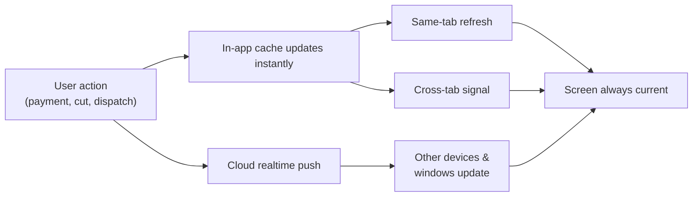
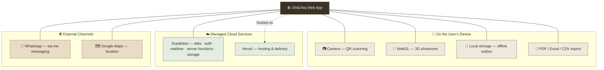

# 🔌 Integrations & Platform Services

> How ShilaTeq (StoneX) connects to the outside world — the cloud services and device capabilities that power the platform, and the deliberate integration choices that keep it simple, cheap, and honest.

[← Back to Documentation Hub](README.md)

---

## Overview

ShilaTeq is a self-contained operating system for a stone yard, but it does not try to be an island. It stands on a small, carefully chosen set of **external services** (a cloud backend, a hosting platform, an embedded map, a messaging channel) and **device capabilities** (the phone's camera, the browser's storage, hardware-accelerated 3D). Each one was selected to deliver real business value without adding cost, lock-in, or operational fragility.

A guiding principle runs through every choice below: **integrate only what earns its keep.** ShilaTeq deliberately avoids heavyweight integrations — payment gateways, email/SMS gateways, accounting connectors, logistics APIs — that would add monthly cost, compliance overhead, and vendor dependency without matching the reality of how a small Indian stone yard actually runs on cash, credit, and WhatsApp. Those deliberate absences are documented at the end of this page and are as much a part of the product strategy as the integrations themselves.

> **Note:** This page describes integrations as **business capabilities**, not as code libraries. Where a capability is delivered by a well-known technology, we name it for transparency, but the focus is always on *what it does for the yard* and *why it exists*.

---

## 📋 Integration Summary

| Integration | Category | Purpose | Business Value |
|---|---|---|---|
| **Supabase** | Cloud backend | Database, authentication, realtime sync, secure server functions, file/photo storage | One managed, secure, multi-tenant backend — no servers to run, data isolated per yard |
| **WhatsApp** (wa.me deep links) | Messaging channel | Send quotes, invoices, dispatch tracking, lead replies, and payment reminders through the app owners already live in | Zero-cost, zero-setup customer communication on India's default business channel |
| **Vercel** | Hosting & deployment | Global delivery of the web app; instant, zero-downtime releases | Fast, always-on access from any phone; no IT infrastructure for the yard to maintain |
| **Google Maps** | Embedded map | Shows the yard's physical location on the public showroom | Buyers can find and trust a real, located business; drives walk-ins |
| **Camera / QR scanning** | Device capability | Scan a block's QR code with the phone camera to pull up its identity instantly | Any worker finds any block in seconds — the core "10-second" promise |
| **PDF & Excel / CSV export** | Document & data export | Generate GST invoices, gate passes, QR labels; export reports and data | Compliant paperwork and portable data with one tap; nothing is trapped inside the app |
| **3D / WebGL showroom** | Device capability | Renders an interactive 3D stone showroom in the browser | A premium online shopfront that turns web visitors into leads |
| **Browser storage / offline** | Device capability | Stores a local queue of worker actions and app data on the device | Work continues through dead zones and bad signal; nothing is lost |

> **💡 Tip:** Everything in the table above is either a **managed cloud service** (Supabase, Vercel) or a **capability already present in the user's phone and browser** (camera, storage, 3D, file export). The yard buys no extra hardware, installs no plugins, and signs up for no additional vendors.

---

## ☁️ Supabase — The Cloud Backend

**Category:** Managed cloud platform (database · authentication · realtime · server functions · storage)

### What it does
Supabase is the secure, managed cloud that stores and protects every yard's data and enforces the platform's business rules. It provides five capabilities ShilaTeq relies on:

- **Cloud database** — the single source of truth for every block, slab, order, invoice, payment, worker, and lead. ✅ Confirmed
- **Authentication** — owner/admin email-and-password login, and a username-only login path for shop-floor workers. ✅ Confirmed
- **Realtime sync** — pushes live updates so that when one user records a payment or marks a delivery, every other open screen in the yard reflects it within seconds, with no manual refresh. ✅ Confirmed
- **Secure server functions** — sensitive operations (reserving stock, executing a cut, applying store credit, processing returns, provisioning a worker login) run as protected server-side routines that clients cannot bypass or tamper with. ✅ Confirmed
- **Storage** — holds block photographs and generated assets. ✅ Confirmed

### Why it exists
A stone yard cannot run a database server, manage backups, or write security policy. Supabase gives ShilaTeq an enterprise-grade backend — with **row-level, per-yard data isolation** enforced on every table — as a managed service, so the product ships with bank-grade multi-tenancy without the yard (or ShilaTeq's operators) maintaining any infrastructure.

### Business Value
- **No servers, no ops.** The yard's data lives in a managed cloud with automated durability. There is nothing to patch, back up, or babysit.
- **True multi-tenant isolation.** Every business table is scoped to a yard, and the database itself refuses to return one yard's data to another's user. Security is enforced at the data layer, not just the screen. (See [Security & Data Isolation](04_User_Roles.md).)
- **Live, shared truth.** Realtime sync means the owner on the office desktop and the supervisor on the yard floor see the same numbers at the same moment.
- **Tamper-proof money logic.** Because reservations, cutting, credit, and returns execute as protected server functions, the financial and inventory rules can't be worked around from a browser.

### User Impact
Users never see "Supabase." They experience it as: instant login, data that's always there, screens that update themselves, and the quiet confidence that another yard can never see their stock or their customers.

---

## 💬 WhatsApp — The Messaging Layer

**Category:** Customer & staff communication channel (via `wa.me` deep links)

### What it does
ShilaTeq turns WhatsApp into its outbound messaging system. Throughout the app, a **WhatsApp button** composes a ready-to-send, pre-formatted message and opens it directly in WhatsApp (web or the phone app) addressed to the right customer, supplier, or worker. Five message types are built in:

| Message | Sent from | Contains |
|---|---|---|
| **Quotation** | Quotations | The quote summary and total, ready to share with a prospective buyer |
| **GST Invoice** | Orders / Invoices | The invoice details for a completed sale |
| **Dispatch + tracking** | Dispatches | Vehicle/dispatch details plus a public live-tracking link |
| **Lead reply** | Leads inbox | A response to a showroom enquiry, with a link back to the catalog |
| **Payment reminder** | Finance | A polite reminder of an outstanding balance |

Customer-facing messages append a small promotional footer linking back to the yard's public showroom; internal reminders deliberately omit it. Replying to a showroom lead via WhatsApp automatically advances that lead from "new" to "contacted." ✅ Confirmed

### Why it exists
In India, WhatsApp *is* business communication — customers, suppliers, and workers all live in it. Building or paying for a separate email or SMS system would push messages onto channels the yard's contacts don't check. By using `wa.me` deep links, ShilaTeq plugs into that channel with **zero API cost, zero setup, and no message-sending fees.**

### Business Value
- **Reach on the channel that actually gets read.** Quotes and reminders land where the customer already is.
- **No messaging bill.** There is no per-message cost and no third-party messaging account to provision or fund.
- **Professional, consistent, and fast.** Every message is templated and correct — no retyping totals or fumbling links — which speeds up quoting and improves collections.
- **A built-in marketing loop.** Every customer message can carry the showroom link, quietly driving repeat traffic.

### User Impact
A supervisor taps "WhatsApp," reviews the pre-written message, and hits send. A payment reminder that used to be an awkward phone call is now a two-tap, polite, on-brand message.

> **Note:** Because ShilaTeq uses WhatsApp's public click-to-chat links rather than the WhatsApp Business API, messages are **composed and sent by the user**, not delivered automatically by a server. This keeps the feature free and instant; automated, unattended WhatsApp sending is noted as a future opportunity in [Product Opportunities](12_Product_Opportunities.md). 💡

---

## ▲ Vercel — Hosting & Deployment

**Category:** Web hosting and delivery platform

### What it does
Vercel hosts ShilaTeq's web application and delivers it globally over a fast content network. New releases are published with instant, zero-downtime deployments. ✅ Confirmed *(the live product runs at `stonevl.vercel.app`)*

### Why it exists
ShilaTeq is a web application by design — nothing to install, works on any phone or computer with a browser. It needs a hosting platform that is fast worldwide, always available, and effortless to release to. Vercel provides that as a managed service.

### Business Value
- **Zero infrastructure for the yard.** The yard just opens a URL. There is no on-premise server, no install, no update chore.
- **Instant, safe updates.** Improvements reach every user the moment they're released, with no downtime and no "please update your app" friction.
- **Fast on modest phones and networks.** Global edge delivery keeps load times low even on the mid-range Android hardware common on a shop floor.

### User Impact
Users bookmark a link (or install it as a home-screen app) and it's simply always there, always current, on whatever device they pick up.

---

## 🗺️ Google Maps — Located, Trustworthy Shopfront

**Category:** Embedded map on the public showroom

### What it does
The public 3D showroom footer embeds a **Google Maps view of the yard's physical location**, so an online visitor can see exactly where the business is and get directions. ✅ Confirmed

### Why it exists
Buyers of high-value stone want to see the material in person and trust they're dealing with a real, established yard. Pinning the business on a familiar map converts an anonymous web page into a visitable, credible destination.

### Business Value
- **Trust and legitimacy.** A mapped, physical address signals a real operation, not a fly-by-night listing.
- **Drives walk-ins.** Directions are one tap away, turning online browsers into showroom visitors.

### User Impact
A prospective buyer scrolling the showroom sees where the yard is, taps for directions, and drives over — arriving already interested in specific blocks they saw online.

---

## 📷 Camera & QR Scanning — Find Any Block in Seconds

**Category:** Device-camera capability (with universal fallback)

### What it does
Every block carries a QR code from the moment it's tagged. ShilaTeq's scanner uses the **phone's camera** to read that code and jump straight to the block's identity card. It prefers the device's fast built-in barcode detection where available and falls back to a software scanner on browsers that lack it, so scanning works across virtually all modern phones. A manual-entry fallback covers the rare case where the camera can't be used. Scanning is available to logged-in workers and, in a safe read-only form, to anyone who scans a block's public QR card. ✅ Confirmed

### Why it exists
This is the founding promise of the product: **any block, found in under ten seconds, from any phone.** A yard holds thousands of near-identical blocks; the camera-plus-QR loop is what makes locating and identifying one instant instead of a walk around the yard.

### Business Value
- **The 10-second lookup.** No walking, no guessing, no paper register — point, scan, done.
- **Fewer mistakes.** Scanning the actual block guarantees the right record, eliminating mix-ups between look-alike stones.
- **Works on the phones people already own.** No dedicated barcode scanners to buy or maintain.

### User Impact
A worker on the floor scans a block and instantly sees its dimensions, grade, status, and history. A visitor scans the QR on a block and sees a safe public identity card — no login required.

---

## 🧾 PDF, Excel & CSV Export — Compliant Paper, Portable Data

**Category:** On-device document generation and data export

### What it does
ShilaTeq generates business documents and data files directly in the browser, with no server round-trip:

- **GST tax invoices** — print-ready, compliant invoices with CGST/SGST/IGST split, HSN code, and the total spelled out in Indian words (lakh/crore). ✅ Confirmed
- **Gate passes / loading slips** — an A4 dispatch document with an embedded live-tracking QR and signature blocks. ✅ Confirmed
- **Block QR labels** — a print-sized label (80×110 mm) to stick on the physical block. ✅ Confirmed
- **Quotations** — a clean, shareable printed quote. ✅ Confirmed
- **Report exports** — analytics panels export to **Excel**, **PDF**, and **image (PNG)**; tabular data exports to **CSV**. ✅ Confirmed

### Why it exists
A yard still needs *paper* — a tax invoice for the buyer, a gate pass for the vehicle at the gate, a label for the block — and *portable data* — a spreadsheet the accountant can open. ShilaTeq produces all of it on demand so the yard never falls back to hand-written challans or retyping figures.

### Business Value
- **One-tap GST compliance.** A correct, professional tax invoice every time, with the tax math done automatically.
- **Real yard operations covered.** Gate passes and stick-on QR labels bridge the software to the physical dock and stockyard.
- **Data is never trapped.** Exports to Excel/CSV mean the owner and their accountant can take the numbers anywhere.
- **Safe by construction.** CSV exports are hardened so that spreadsheet formula tricks can't execute, and rupee symbols survive correctly in Excel.

### User Impact
A supervisor finalizes a sale and prints a GST invoice for the customer and a gate pass for the truck — both from the same screen, both correct, in seconds. An owner exports the month's profit report to Excel to share with their accountant.

---

## 🧊 3D / WebGL Showroom — The Online Shopfront

**Category:** Hardware-accelerated 3D rendering in the browser

### What it does
The public catalog opens with an **interactive 3D stone block** and a showroom experience rendered live in the browser using the device's graphics hardware. If a device can't handle 3D — or the visitor prefers reduced motion — it gracefully falls back to a pure-CSS animated stone so the page never breaks. Stone imagery across the showroom is generated as crisp, lightweight artwork rather than heavy photo downloads. ✅ Confirmed

### Why it exists
Stone is a premium, tactile product. A flat photo grid doesn't do it justice, and it doesn't differentiate the yard. A tasteful, performant 3D showroom makes a small yard look world-class online and gives buyers a richer sense of the material — turning a web visit into an enquiry.

### Business Value
- **A premium first impression.** The yard's online presence looks like a modern brand, not a classified ad.
- **Lead generation, not just display.** The showroom is a funnel — every stone can prompt a quote request that lands in the admin inbox.
- **Robust everywhere.** The guaranteed fallback means the showroom loads and looks good even on low-end devices, so no visitor is turned away.

### User Impact
A prospective buyer explores the yard's stone in an engaging 3D shopfront, taps a block, and requests a quote — becoming a tracked lead the yard can follow up on WhatsApp.

---

## 📴 Browser Storage & Offline — Work Through the Dead Zones

**Category:** On-device storage and offline queue

### What it does
ShilaTeq stores an **offline outbox** on the worker's device. When a worker logs a cutting result or completes a task step with no signal, the action is saved locally and the screen updates immediately as if it had gone through. The moment connectivity returns, the app **automatically syncs** the queued actions in order — safely, without duplicates, and without ever overwriting fresher data. A sync indicator shows the worker what's saved, what's syncing, and what (rarely) needs attention, with a one-tap retry. ✅ Confirmed

### Why it exists
Stone yards have concrete walls, metal roofs, and outdoor lots — connectivity is patchy by nature. If the software stopped working every time the signal dropped, workers would abandon it and go back to paper. On-device storage guarantees that **a bad signal never stops work and never loses data.**

### Business Value
- **Uninterrupted shop-floor operations.** Cutting and task logging continue through outages; nothing waits on the network.
- **Zero data loss.** Every action is captured locally and reconciled automatically — no re-entry, no forgotten records.
- **Conflict-safe.** The sync engine is built so a delayed action can never clobber a newer state; stale updates are dropped rather than applied blindly.

### User Impact
A cutter in a signal dead-zone logs a full day of output and never sees an error. When they walk back into coverage, everything quietly syncs. An offline banner reassures them: *"Offline — your progress is saved and will sync automatically."*

> **⚠️ Limitation:** The offline queue currently covers **worker shop-floor actions** (cutting, task steps, deliveries). The admin app still needs a connection to *first load* its pages — there is no full offline caching layer for the office side yet. This is called out as an opportunity in [Product Opportunities](12_Product_Opportunities.md).

---

## 🧭 Live Data Freshness — How Everything Stays in Sync

Rather than constantly polling the server, ShilaTeq keeps screens current through a layered freshness system: an **in-app cache** for speed, **event-driven refresh** the instant anything changes, a **cross-tab signal** so multiple open windows agree, and **realtime cloud push** so a change made on one device appears on another. The result feels effortless — numbers update themselves — while staying light on the network and gentle on modest phones. ✅ Confirmed

---

## 🚫 Deliberately Not Integrated (Yet) — and Why It Matters

ShilaTeq's integration list is short **on purpose.** The following are conscious absences, not oversights. Each was left out because it would add cost, complexity, or compliance burden that doesn't match how the target yard operates today — and each is a clear, deliberate future step.

### 💡 No online payment gateway
**What's absent:** There is no Stripe/Razorpay-style online card/UPI checkout. Payments (cash, UPI, bank transfer, card, credit note) are **recorded manually** as they happen.

**Why it matters — and why it's the right call for now:**
- The target market runs on **cash and informal credit**; buyers pay by cash, cheque, or direct UPI, not card-on-file.
- Avoiding a gateway means **no transaction fees, no PCI/compliance overhead, and no settlement dependency** — the yard keeps 100% of every rupee and isn't gated on a processor.
- The trade-off: reconciliation is manual, and there's no automatic payment capture. Adding an optional online-payment/UPI-collection integration is a natural premium upgrade — see [Product Opportunities](12_Product_Opportunities.md).

### 💡 No email or SMS provider
**What's absent:** No transactional email or SMS gateway. Outbound messaging is via **WhatsApp deep links** plus in-app notifications.

**Why it matters:**
- WhatsApp is where the yard's customers, suppliers, and workers actually are — email and SMS would land where no one looks.
- Skipping an email/SMS vendor means **no per-message fees and no sender-reputation/deliverability headaches.**
- The trade-off: there are no fully automated, unattended reminders yet (a person taps send). A future WhatsApp Business API or email digest layer would enable hands-off automation. 💡

### 💡 No accounting-software sync
**What's absent:** No direct connector to Tally, Zoho Books, QuickBooks, or similar.

**Why it matters:**
- ShilaTeq already produces GST-compliant invoices and **Excel/CSV exports**, so the accountant can bring the numbers into any package today.
- A one-way or two-way accounting integration (especially **Tally**, ubiquitous in Indian SMBs) is a high-value, well-scoped future add-on — the export path proves the data is ready for it. 💡

### 💡 No logistics / transporter API
**What's absent:** No integration with courier or fleet-tracking APIs. Dispatch is managed in-app with gate passes, driver assignment, and a **public tracking link**.

**Why it matters:**
- Most yards use **local, informal transport** (owned trucks, hired vehicles) rather than API-connected carriers, so an in-app gate pass and shareable tracking link fit reality better than a courier integration.
- The trade-off: no automatic carrier tracking updates. A logistics/e-way-bill API integration is a sensible enterprise-tier addition. 💡

> **Note:** These absences are a strategic feature of ShilaTeq's positioning: it delivers a *complete* operating system for a small stone yard **without forcing the yard to sign up for, fund, or integrate a stack of third-party services.** As customers grow, each of these becomes an opt-in upgrade rather than a day-one requirement.

---

## Integration Landscape at a Glance

---

## Related Reading

- [Notifications](09_Notifications.md) — how WhatsApp, realtime, alerts, and the activity log work together
- [Product Strengths](11_Product_Strengths.md) — why these integration choices are competitive advantages
- [Product Opportunities](12_Product_Opportunities.md) — the roadmap for payment, messaging, accounting, and logistics integrations
- [FAQ](13_FAQ.md) — common questions about integrations, payments, and data

---

*Part of the **ShilaTeq (StoneX) Product Documentation Hub** — the operating system for stone yards.*
