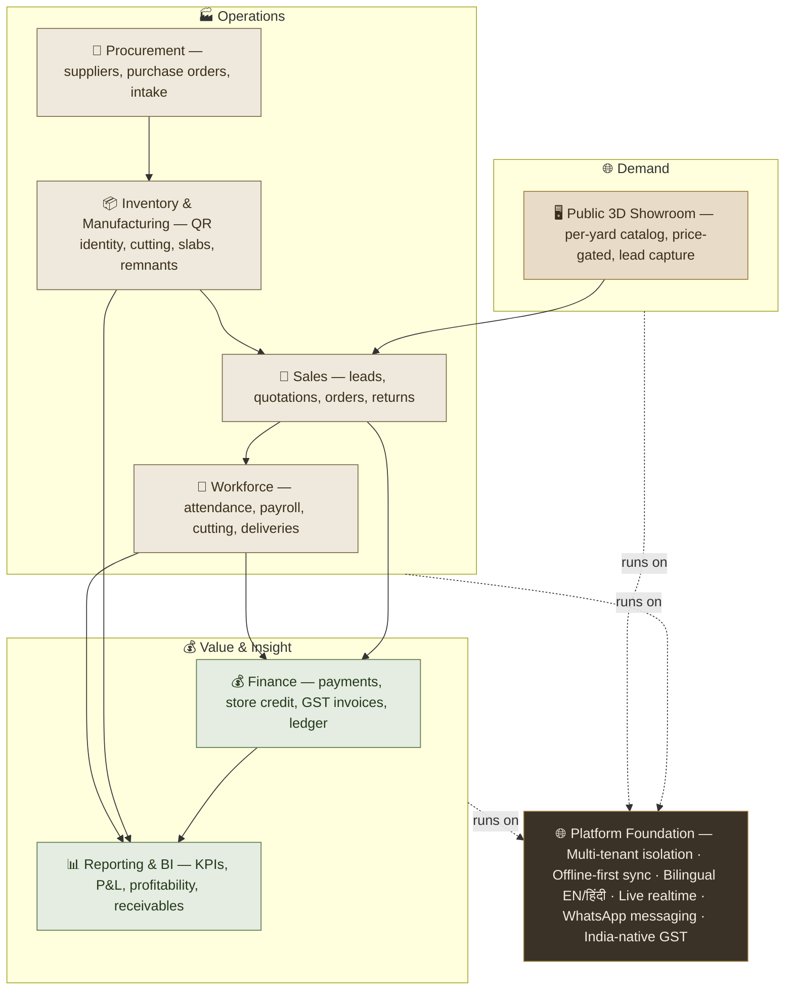

# 🪨 ShilaTeq (StoneX) — Product Documentation Hub

> The operating system for stone yards. Every block gets a QR-coded digital identity the moment it arrives, and from there ShilaTeq runs the whole business — procurement, cutting, quotes, orders, GST invoices, dispatch, payments, payroll, and a public 3D showroom that turns web visitors into leads.

Welcome to the official product documentation for **ShilaTeq (StoneX)** — a vertical ERP built for the way stone yards actually work: on cheap Android phones, in Hindi and English, across patchy shop-floor connectivity, in rupees and GST. This hub is the polished front door to everything the product does and why it matters.

---

## 🏷️ Product Name

**ShilaTeq** is the customer-facing product. *(The underlying codebase, database, and deployment carry the internal engineering name **StoneX**; you may see it in URLs such as `stonevl.vercel.app`.)* Throughout this hub we refer to the product as **ShilaTeq**.

> **Note:** "Shila" (शिला) is the Sanskrit/Hindi word for *stone* or *rock*. ShilaTeq is, literally, *stone technology*.

## 🎯 Elevator Pitch

> **ShilaTeq is the operating system for stone yards.** Every block gets a QR-coded digital identity the moment it arrives, and from there the platform runs the entire business — procurement, cutting, quotations, orders, GST invoices, dispatch, payments, and payroll — while a public 3D showroom turns web visitors into leads. It works on any phone, in English or Hindi, and keeps working when the internet doesn't. Owners finally see exactly what they own, what it cost, who owes them, and what it's worth — instead of running a multi-crore business from a paper register and memory.

## 🔭 Product Vision

> **Be the operating system for the dimensional-stone trade** — replace paper registers, chalk-marked blocks, WhatsApp photos, and the owner's memory with a single source of truth for every block, cut, rupee, and customer.

The stone trade is one of the largest under-digitised physical industries in India. A single yard may hold **crores of rupees** of inventory as thousands of near-identical blocks, yet run entirely on handwriting, memory, and trust. ShilaTeq's vision is to give that industry the same operational clarity a modern warehouse or factory takes for granted — without asking a low-literacy workforce to change how they work or a family-run business to buy new hardware.

## 🧭 Mission

> **Give every stone block a permanent digital identity, and let a yard run its entire business — quarry intake to delivered invoice — from any phone, even offline, in the worker's own language.**

Every design decision in ShilaTeq serves that mission: QR identity so a block is never lost; offline-first sync so a bad signal never stops work; bilingual, icon-first screens so literacy is never a barrier; India-native GST so compliance is one tap, not a headache.

## ❗ The Business Problem

Traditional stone yards suffer a set of chronic, expensive problems. ShilaTeq targets each one directly.

| Industry pain | What it costs the yard | ShilaTeq's answer |
|---|---|---|
| **"Where is that white marble block?"** — thousands of blocks, no index | Hours of walking the yard; lost sales while a buyer waits | QR identity on every block + typo-tolerant search — findable in seconds from a phone |
| **Dead capital in aged stock** — slow movers quietly rot cash | Locked-up working capital, silent losses | Automatic aging buckets (fresh / amber / red) + carrying-cost alerts |
| **No idea of true margin** — cost is guessed; cutting wastage is invisible | Selling below cost without knowing it | Recovery-adjusted costing + sale-time COGS snapshots + per-block margin |
| **Cutting yield leakage** — slabs are never reconciled against the block | Unaccounted material loss on every cut | Partial-cut engine: recovery %, wastage, remnant blocks, immutable cut ledger |
| **Credit & payment leakage** — sold on informal credit, overpayments lost | Bad debt, unrecoverable exposure | Credit-limit gates, store-credit ledger, receivables aging, payment gating |
| **Manual GST invoicing** — error-prone tax splits, no compliant documents | Compliance risk, wasted hours | One-click GST invoices (CGST/SGST/IGST, HSN, amount-in-words) + gate passes |
| **No shopfront** — buyers can't see stock; leads walk away | Missed demand, zero online presence | Public 3D showroom per yard with price-gating and lead capture |
| **Connectivity & language gaps on the shop floor** | Work stalls; workers can't use the software | Offline-first worker app, bilingual EN/हिंदी, icon- and number-first |

## 👥 Target Customers

ShilaTeq is built around five real people who touch a stone yard every day:

| Persona | Role | What they need |
|---|---|---|
| **Rajesh — Yard Owner / Admin** | Primary buyer & daily admin user | Full visibility of stock, cash, margin, and staff — one screen that tells the truth |
| **Sunil — Supervisor / Manager** | Operates the admin app | Create quotes and orders, record payments, assign work, dispatch goods |
| **Ramesh — Shop-floor Worker / Cutter** | Phone-only, low-literacy, Hindi | Simple, offline, tap-based screens to log cutting output and task steps; see own pay |
| **Vijay — Driver** | A worker assigned to a dispatch | See only their deliveries; mark in-transit and delivered |
| **Priya — Prospective Buyer** | Public / guest, no login | Browse a yard's available stone online and request a quote |

See [User Roles](04_User_Roles.md) for the full permissions matrix and [User Journeys](05_User_Journeys.md) for each persona's day-in-the-life.

## 🏭 Target Industries

- **Core:** Natural / dimensional stone — **marble, granite, sandstone, limestone**: quarrying, processing (gangsaw cutting blocks into slabs), and trading.
- **Primary segment:** Small-to-mid, **family-run stone yards, processors, and traders**, predominantly across India's stone belts — **Rajasthan and Gujarat** especially.
- **Adjacent expansion:** tiles, engineered/quartz stone, and export-oriented processors. 💡 *Inferred*

> **💡 Inferred (market context):** India's stone hubs contain **thousands** of such yards, most running on near-zero software despite managing high-value inventory where a single block can be worth lakhs. The market is large, fragmented, cash-and-credit intensive, and almost entirely greenfield for purpose-built software.

## 💎 Core Value Proposition

**For stone-yard owners** who lose money and time to untracked inventory, hidden margins, and credit leakage, **ShilaTeq** is a **mobile-first stone-yard ERP** that **gives every block a digital identity and runs the entire sell-side and shop-floor lifecycle in one place.**

Unlike **paper registers, spreadsheets, or generic accounting software**, ShilaTeq is **purpose-built for the physics and economics of stone** — volumetric pricing, cutting recovery, block/slab lifecycles, carrying cost, and GST — and is **usable offline by a Hindi-speaking workforce**.

> **The four things ShilaTeq never lets a yard lose track of:**
> 1. **The stone** — every block/slab: location, dimensions, grade, cost, age, status.
> 2. **The money** — receivables, payables, payments, store credit, credit limits, expenses, payroll, margin.
> 3. **The people** — attendance, wages, advances, piece-rate cutting, delivery assignments.
> 4. **The customer** — quotations, orders, GST invoices, dispatch tracking, returns, inbound leads.

## 🌟 Key Capabilities

| Capability area | What it delivers |
|---|---|
| 📦 **Inventory & identity** | QR-coded blocks & slabs, 3-stage tagging wizard, aging & carrying-cost, typo-tolerant search, per-block analytics |
| 🪚 **Manufacturing** | Partial-cut engine (block → slabs + remnant), recovery %, wastage, immutable cut-event ledger |
| 🛒 **Sales** | Quotation wizard with GST preview, orders with credit gates & atomic reservation, order editing under reservation, returns/RMA |
| 🚚 **Procurement** | Suppliers, purchase-order wizard, receive-to-blocks intake, supplier payments & payables |
| 💰 **Finance** | Payments in/out, store-credit ledger, credit limits, unified ledger, expenses cashbook, one-click GST invoices |
| 👷 **Workforce** | Worker provisioning & login, attendance register with wage snapshots, payroll, advances, piece-rate cutting |
| 🧾 **Logistics** | Dispatch & gate passes, driver assignment & deliveries, public dispatch tracking, delivery-to-sold reconciliation |
| 🖥️ **Public showroom** | Per-yard 3D catalog with per-block price gating and lead capture into an admin inbox |
| 📊 **Reporting & BI** | Dashboard KPIs & alerts, 5-tab analytics (P&L, Sales, Inventory, Profitability, Receivables), CSV/Excel/PDF/PNG exports |
| 🌐 **Platform** | Multi-tenant isolation, bilingual EN/हिंदी worker UX, offline-first sync, live realtime updates, WhatsApp messaging |

Explore each in depth in [Features](02_Features.md) and [Modules](03_Modules.md).

## 🏛️ High-Level Product Architecture (Business View)

ShilaTeq is best understood as a stack of **business capabilities** layered on a single multi-tenant, offline-capable platform. The public showroom sits at the top as the demand funnel; below it, the operational layers move stone from procurement to delivered invoice; finance and reporting cut across everything.

**How to read it:** demand enters through the **public showroom** as leads. Those leads flow into **Sales**, which draws on **Inventory & Manufacturing** (fed upstream by **Procurement**) to build quotes and orders. Fulfilling an order engages the **Workforce** (cutting, assignment, delivery). Every commercial event settles into **Finance** (payments, store credit, GST invoices), and everything — stock, people, money — rolls up into **Reporting & BI**. All of it runs on one **platform foundation** that is multi-tenant, offline-capable, bilingual, realtime, and India-native.

> **Note:** This is a *business-capability* view, not a technical architecture diagram. For deployment shape, data model, and infrastructure, see [Integrations](10_Integrations.md).

## 📚 Documentation Index

Every document in this hub, at a glance. Start with the [Product Overview](01_Product_Overview.md) for the guided tour, or jump straight to the topic you need.

| # | Document | What's inside |
|---|---|---|
| — | **[README.md](README.md)** *(you are here)* | Executive overview, vision, capabilities, and this documentation index |
| 01 | **[01_Product_Overview.md](01_Product_Overview.md)** | A guided demo narrative — how ShilaTeq works end-to-end, from block intake to delivered invoice |
| 02 | **[02_Features.md](02_Features.md)** | Every feature in the product, described in full |
| 03 | **[03_Modules.md](03_Modules.md)** | The logical modules that make up the platform and how they fit together |
| 04 | **[04_User_Roles.md](04_User_Roles.md)** | Roles (Admin, Worker, Driver, Public) and the full permissions matrix |
| 05 | **[05_User_Journeys.md](05_User_Journeys.md)** | Persona-driven journeys with flow diagrams for each key path |
| 06 | **[06_Screens_and_Pages.md](06_Screens_and_Pages.md)** | A tour of every screen and page in the product |
| 07 | **[07_Business_Workflows.md](07_Business_Workflows.md)** | Core business workflows and state machines, with diagrams |
| 08 | **[08_Reports_and_Analytics.md](08_Reports_and_Analytics.md)** | The reporting and business-intelligence layer, KPIs, and exports |
| 09 | **[09_Notifications.md](09_Notifications.md)** | Alerts, toasts, WhatsApp messaging, realtime updates, and the activity log |
| 10 | **[10_Integrations.md](10_Integrations.md)** | External integrations, platform services, and the technology stack |
| 11 | **[11_Product_Strengths.md](11_Product_Strengths.md)** | Strengths and differentiators — what sets ShilaTeq apart |
| 12 | **[12_Product_Opportunities.md](12_Product_Opportunities.md)** | Honest improvement opportunities and the road ahead |
| 13 | **[13_FAQ.md](13_FAQ.md)** | Frequently asked questions from buyers, users, and stakeholders |
| 14 | **[14_Product_Summary.md](14_Product_Summary.md)** | The executive close — a leave-behind summary for stakeholders and investors |

---

## 🚀 Where to Start

- **New here?** Read the **[Product Overview](01_Product_Overview.md)** for a narrated demo of the full lifecycle.
- **Evaluating the product?** Skim **[Product Strengths](11_Product_Strengths.md)** and close with the **[Product Summary](14_Product_Summary.md)**.
- **Understanding the workflows?** Go straight to **[Business Workflows](07_Business_Workflows.md)**.

> **💡 Tip:** ShilaTeq ships with a **zero-infrastructure demo mode** — a full in-browser experience with realistic seed data — so the entire product can be explored and demonstrated without any server setup.

---

*Part of the **ShilaTeq (StoneX) Product Documentation Hub** — the operating system for stone yards.*
